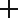
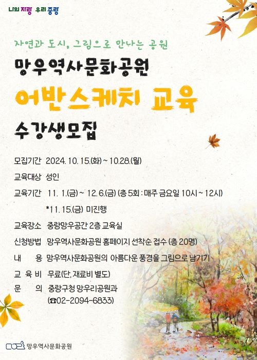
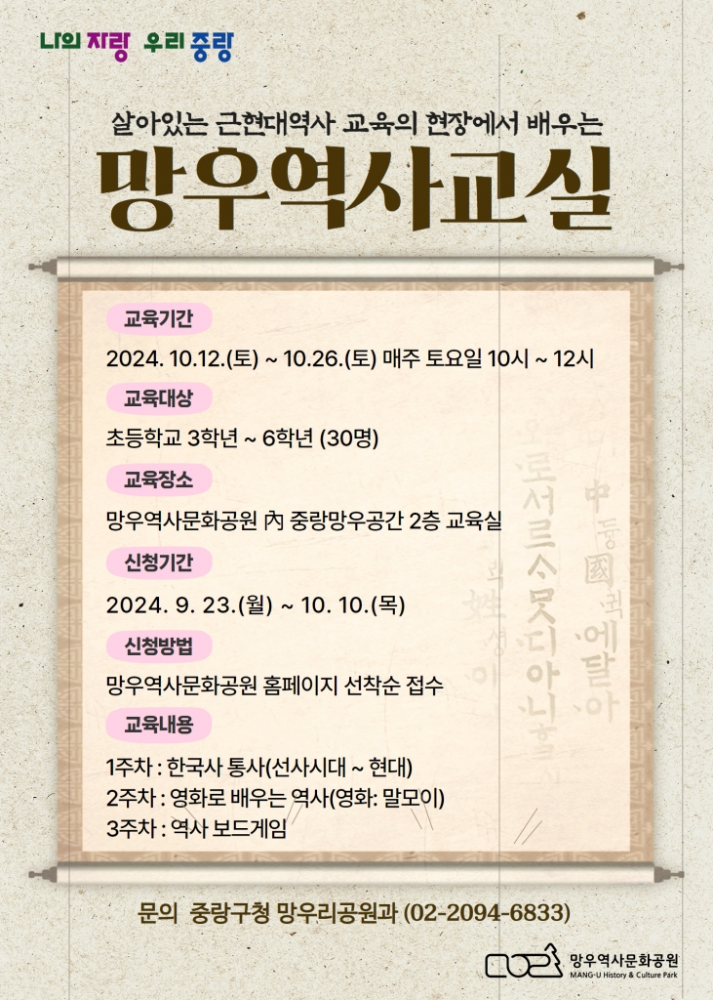
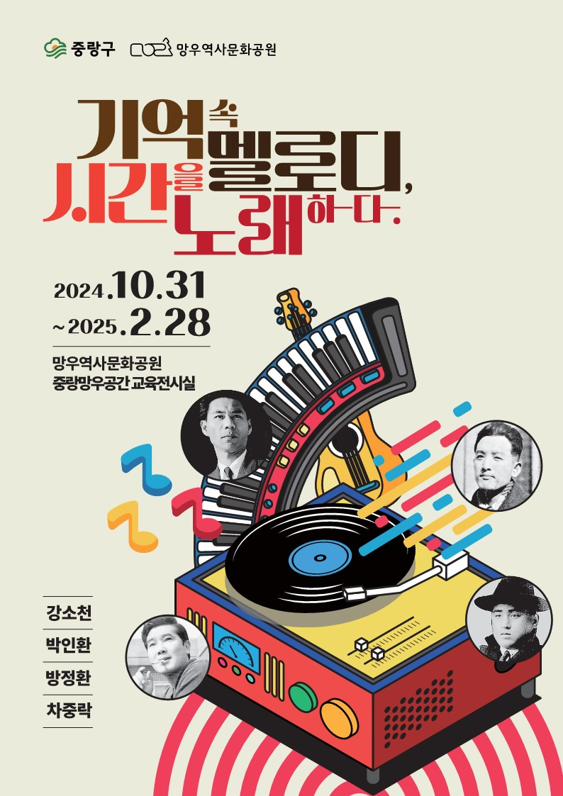
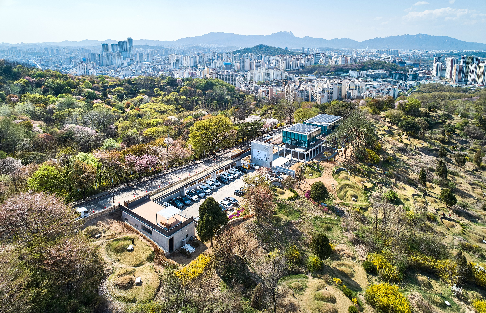
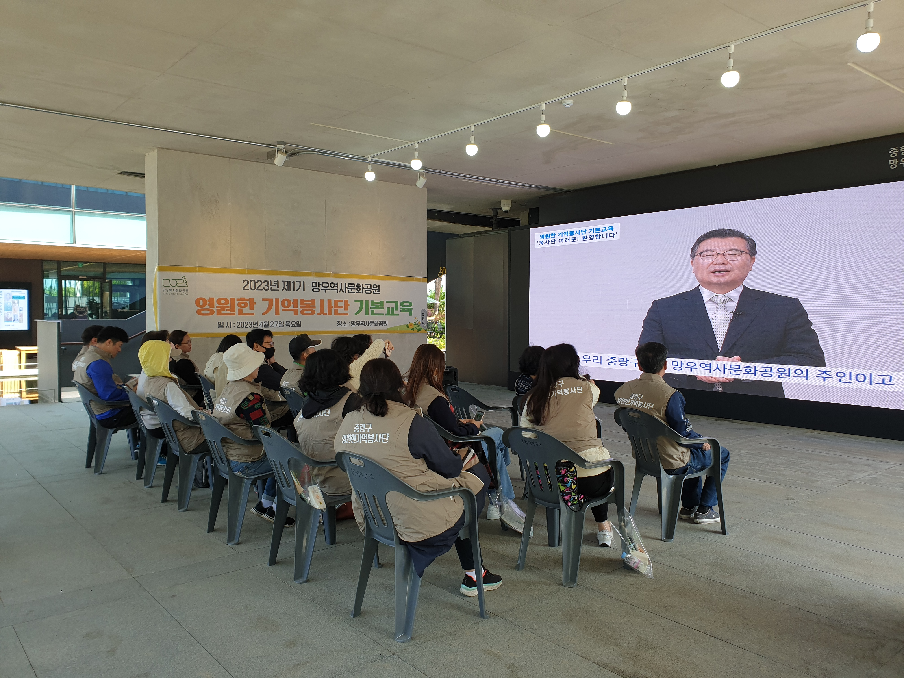

### Project - 망우역사문화공원

클론코딩을 진행하였습니다.
각 구역마다 기존의 페이지와 다르게 디자인 된 부분이 있습니다.

### 0️⃣ - 기본 설정

      <!DOCTYPE html>
      <html lang="en">
      
      <head>
        <meta charset="UTF-8">
        <meta name="viewport" content="width=device-width, initial-scale=1.0">
        <title>망우역사문화공원</title>
        <link rel="stylesheet" href="./css/style.css">
        <link rel="icon" href="./img/logo.png" type="image/x-icon">
        <meta name="description" content="망우역사문화공원">
        <meta name="keywords" content="HTML, CSS, JavaScript, JQuery, Gsap, Swiper">
        <meta name="robots" content="index, follow">
        <meta property="og:title" content="망우역사문화공원">
        <meta property="og:description" content="망우역사문화공원">
        <meta property="og:image" content="https://raw.githubusercontent.com/SeongUkJang/project-mang-u-history-culture-park/refs/heads/main/img/logo.png">
        <meta property="og:url" content="https://seongukjang.github.io/project-mang-u-history-culture-park/">
        <meta property="og:type" content="website">
        <meta name="author" content="장성욱">
        <meta name="copyright" content="© 2025 my company">
        <!-- <meta http-equiv="refresh" content="5; url=https://example.com"> -->
        <meta http-equiv="X-UA-Compatible" content="IE=edge">
      </head>
    <body>
    
      <script src="https://cdnjs.cloudflare.com/ajax/libs/jquery/3.7.1/jquery.min.js"></script>
      <script src="https://cdn.jsdelivr.net/npm/swiper@11/swiper-bundle.min.js"></script>
    
      <script src="./js/script.js"></script>
      <script type="module" src="./js/tab.js"></script>
    </body>
    
    </html>
    ```
    
- reset.css
    
    ```css
    @import url('https://fonts.googleapis.com/css2?family=Inter:ital,opsz,wght@0,14..32,100..900;1,14..32,100..900&family=Noto+Sans+KR:wght@100..900&display=swap');
    @import url("https://cdn.jsdelivr.net/gh/orioncactus/pretendard@v1.3.9/dist/web/static/pretendard.min.css");
    
    html {
        font-size: 62.5%;
    }
    body {
        overflow-x:hidden ;
    }
    
    * {
        margin: 0;
        padding: 0;
        box-sizing: border-box;
    }
    /* reset */
    body,
    p,
    h1,
    h2,
    h3,
    h4,
    h5,
    h6,
    ul,
    ol,
    li,
    dl,
    dt,
    dd,
    table,
    th,
    td,
    form,
    fieldset,
    legend,
    input,
    textarea,
    button,
    select,
    figure,
    figcaption {
        margin: 0;
        padding: 0
    }
    
    body,
    input,
    textarea,
    select,
    button,
    table {
        font-family: 'Noto Sans KR', 'Open Sans', AppleGothic, helvetica, sans-serif;
        font-size: 16px;
        line-height: 1.75em;
        letter-spacing: -.04em;
        color: #505050;
        word-break: keep-all;
        -webkit-text-size-adjust: none;
    }
    
    img {
        border: 0;
        max-width: 100%;
        vertical-align: top;
    }
    
    ul,
    ol {
        list-style: none
    }
    
    fieldset {
        border: none
    }
    
    fieldset legend {
        overflow: hidden;
        width: 0;
        height: 0;
        margin: 0;
        padding: 0;
        font-size: 0;
        line-height: 0;
        text-indent: -999em;
    }
    
    button {
        cursor: pointer
    }
    
    header,
    hgroup,
    article,
    nav,
    footer,
    figure,
    figcaption,
    canvas,
    section,
    time {
        display: block
    }
    
    hr {
        clear: both;
        display: none;
    }
    
    img[usemap] {
        border: none;
        height: auto;
        max-width: 100%;
        width: auto;
    }
    
    a {
        color: inherit;
        text-decoration: none;
        -webkit-transition: all 0.2s ease-in-out;
        -moz-transition: all 0.2s ease-in-out;
        -ms-transition: all 0.2s ease-in-out;
        -o-transition: all 0.2s ease-in-out;
        transition: all 0.2s ease-in-out;
    }
    
    a:hover,
    a:active {
        -webkit-transition: all 0.2s ease-in-out;
        -moz-transition: all 0.2s ease-in-out;
        -ms-transition: all 0.2s ease-in-out;
        -o-transition: all 0.2s ease-in-out;
        transition: all 0.2s ease-in-out;
    }
    
    ::-webkit-input-placeholder {
        color: #878787;
    }
    
    :-moz-placeholder {
        color: #878787;
    }
    
    ::-moz-placeholder {
        color: #878787;
    }
    
    :-ms-input-placeholder {
        color: #878787;
    }
    
    :placeholder-shown {
        color: #878787;
    }
    
    table caption {
        overflow: hidden;
        width: 0;
        height: 0;
        margin: 0;
        padding: 0;
        font-size: 0;
        line-height: 0;
        text-indent: -999em;
    }
    
    input[type="radio"],
    input[type="checkbox"] {
        vertical-align: middle !important;
        margin: -.2em 3px 0 0 !important;
    }
    
    input,
    select {
        vertical-align: middle;
        background: #fff;
    }
    
    input,
    textarea,
    button {
        -webkit-appearance: none;
        -webkit-border-radius: 0
    }
    
    input[type='checkbox'] {
        -webkit-appearance: checkbox
    }
    
    input[type='radio'] {
        -webkit-appearance: radio
    }
    
    /* user class */
    h1,
    h2,
    h3,
    h4,
    h5,
    h6,
    strong,
    th,
    .bold {
        font-weight: 700;
    }
    
    .semibold {
        font-weight: 500;
    }
    
    .clear {
        clear: both;
    }
    
    .clearfix:after {
        content: " ";
        display: block;
        clear: both;
    }
    
    .blind {
        position: absolute;
        overflow: hidden;
        width: 0;
        height: 0;
        margin: 0;
        padding: 0;
        font-size: 0;
        line-height: 0;
    }
    
    .pointer {
        cursor: pointer;
    }
    
    .input {
        height: 44px;
        padding: 6px 16px;
        color: #505050;
        font-size: 15px;
        line-height: 1.5em;
        border: 1px solid #ddd;
    }
    
    .input[readonly] {
        background-color: #eee;
        color: #878787;
    }
    
    ```
    
- common.css
    
    ```css
    .rel {
        max-width: 126rem;
        position: relative;
        margin: auto;
        height: 100%;
        padding: 0 3rem;
    }
    
    header,
    section {
        position: relative;
    }
    
    .info-btn {
        display: inline-flex;
        width: 17rem;
        height: 8.6rem;
        align-items: center;
        background-color: #0082CA;
        color: #fff;
        justify-content: space-evenly;
    }
    
    .info-btn.dark {
        margin-left: .5rem;
        background-color: #11416F;
    }
    
    section h2 {
        font-size: 3.6rem;
        font-weight: 700;
    }
    
    .in-wrap {
        padding: 4rem;
        
    }
    
    .in-wrap .tit-wrap {
        display: flex;
        justify-content: space-between;
        align-items: center;
    
    }
    .in-wrap .tit-wrap h3{
        font-size: 2.8rem;
        line-height: 3.6rem;
        font-weight: 600;
    }
    .in-add-btn{
    
    }
    
    .in-slider-wrap{
        margin-top: 2rem;
        
    }
    
    .in-slider-wrap .swiper-pagination{
        position: static;
    }
    ```
    
- style.css
    
    ```css
    @import url(https://cdn.jsdelivr.net/npm/swiper@11/swiper-bundle.min.css);
    
    @import url(reset.css);
    @import url(common.css);
    @import url(layout.css);
    ```
    
- peopledata.js
    
    ```jsx
    export const peopleData = {
        "tab-0": [ // 애국지사
            {
                "name": "도산 안창호",
                "birth_date": "1878.11.09",
                "death_date": "1938.03.10",
                "title": "내 평생을 대한의 독립을 위해",
                "image": "img/tab-1-1.jpg",
                "profile_link": "#"
            },
            {
                "name": "태허 유상규",
                "birth_date": "1897.11.10",
                "death_date": "1936.07.18",
                "title": "상해에서 도산을 위해 도산의 아들 모양으로 헌신적으로 힘을 썼다",
                "image": "img/tab-1-2.jpg",
                "profile_link": "#"
            },
            {
                "name": "지기 문명훤",
                "birth_date": "1892.11.30",
                "death_date": "1953.10.23",
                "title": "한글을 연구한 애국지사",
                "image": "img/tab-1-3.jpg",
                "profile_link": "#"
            },
            {
                "name": "위창 오세창",
                "birth_date": "1864.07.15",
                "death_date": "1953.04.16",
                "title": "근대 최고의 서화가",
                "image": "img/tab-1-4.jpg",
                "profile_link": "#"
            },
            {
                "name": "호암 문일평",
                "birth_date": "1888.05.15",
                "death_date": "1939.04.03",
                "title": "조선정신의 사학자",
                "image": "img/tab-1-5.jpg",
                "profile_link": "#"
            },
            {
                "name": "송암 서병호",
                "birth_date": "1885.07.07",
                "death_date": "1972.06.07",
                "title": "나라가 있어야 내가 있다",
                "image": "img/tab-1-6.jpg",
                "profile_link": "#"
            },
            {
                "name": "만해 한용운",
                "birth_date": "1879.08.29",
                "death_date": "1944.06.29",
                "title": "진실된 애국을 노래하다",
                "image": "img/tab-1-7.jpg",
                "profile_link": "#"
            },
            {
                "name": "오기만",
                "birth_date": "1905.08.21",
                "death_date": "1937.08.23",
                "title": "상해한인청년동맹 집행위원장",
                "image": "img/tab-1-8.jpg",
                "profile_link": "#"
            },
            {
                "name": "남파 박찬익",
                "birth_date": "1884.01.29",
                "death_date": "1949.03.09",
                "title": "모름지기 우리는 공명심을 버리고 조국 독립에 무명의 전사가 되자.",
                "image": "img/tab-1-9.jpg",
                "profile_link": "#"
            }
        ],
        "tab-1": [ // 문화예술
            {
                "name": "계용묵",
                "birth_date": "1904.09.08",
                "death_date": "1961.08.09",
                "title": "「백치 아다다」의 작가",
                "image": "img/tab-2-1.jpg",
                "profile_link": "#"
            },
            {
                "name": "박인환",
                "birth_date": "1926.08.15",
                "death_date": "1956.03.20",
                "title": "시를 남기고 떠난 목마",
                "image": "img/tab-2-2.jpg",
                "profile_link": "#"
            },
            {
                "name": "강소천",
                "birth_date": "1915.09.16",
                "death_date": "1963.05.06",
                "title": "영원한 어린이의 벗",
                "image": "img/tab-2-3.jpg",
                "profile_link": "#"
            },
            {
                "name": "김말봉",
                "birth_date": "1901",
                "death_date": "1962",
                "title": "여성 최초의 예술원 회원",
                "image": "img/tab-2-4.jpg",
                "profile_link": "#"
            },
            {
                "name": "권진규",
                "birth_date": "1922.04.07",
                "death_date": "1973.05.04",
                "title": "근대 조각가의 선구자",
                "image": "img/tab-2-5.jpg",
                "profile_link": "#"
            },
            {
                "name": "소파 방정환",
                "birth_date": "1899.11.09",
                "death_date": "1931.07.23",
                "title": "짓밟히고 학대받고 쓸쓸하게 자라는 어린 혼을 구원하자",
                "image": "img/tab-2-6.jpg",
                "profile_link": "#"
            },
            {
                "name": "계용묵",
                "birth_date": "1904.09.08",
                "death_date": "1961.08.09",
                "title": "「백치 아다다」의 작가",
                "image": "img/tab-2-1.jpg",
                "profile_link": "#"
            },
            {
                "name": "박인환",
                "birth_date": "1926.08.15",
                "death_date": "1956.03.20",
                "title": "시를 남기고 떠난 목마",
                "image": "img/tab-2-2.jpg",
                "profile_link": "#"
            },
            {
                "name": "강소천",
                "birth_date": "1915.09.16",
                "death_date": "1963.05.06",
                "title": "영원한 어린이의 벗",
                "image": "img/tab-2-3.jpg",
                "profile_link": "#"
            },
            {
                "name": "김말봉",
                "birth_date": "1901",
                "death_date": "1962",
                "title": "여성 최초의 예술원 회원",
                "image": "img/tab-2-4.jpg",
                "profile_link": "#"
            },
            {
                "name": "권진규",
                "birth_date": "1922.04.07",
                "death_date": "1973.05.04",
                "title": "근대 조각가의 선구자",
                "image": "img/tab-2-5.jpg",
                "profile_link": "#"
            },
            {
                "name": "소파 방정환",
                "birth_date": "1899.11.09",
                "death_date": "1931.07.23",
                "title": "짓밟히고 학대받고 쓸쓸하게 자라는 어린 혼을 구원하자",
                "image": "img/tab-2-6.jpg",
                "profile_link": "#"
            },
    
        ],
        "tab-2": [ // 사회인사
            {
                "name": "송촌 지석영",
                "birth_date": "1855.05.15",
                "death_date": "1935.02.01",
                "title": "전염병 퇴치에 앞장선 예방의학자",
                "image": "img/tab-3-1.jpg",
                "profile_link": "#"
            },
            {
                "name": "학범 박승빈",
                "birth_date": "1880.09.29",
                "death_date": "1943.10.30",
                "title": "조선어학연구회 창시자",
                "image": "img/tab-3-2.jpg",
                "profile_link": "#"
            },
            {
                "name": "소오 설의식",
                "birth_date": "1901.01.27",
                "death_date": "1954.07.21",
                "title": "영원한 언론인",
                "image": "img/tab-3-3.jpg",
                "profile_link": "#"
            },
            {
                "name": "죽산 조봉암",
                "birth_date": "1899.09.25",
                "death_date": "1959.07.31",
                "title": "좌우 통합의 이상적인 정치인",
                "image": "img/tab-3-4.jpg",
                "profile_link": "#"
            },
            {
                "name": "소오 설의식",
                "birth_date": "1901.01.27",
                "death_date": "1954.07.21",
                "title": "영원한 언론인",
                "image": "img/tab-3-3.jpg",
                "profile_link": "#"
            },
            {
                "name": "죽산 조봉암",
                "birth_date": "1899.09.25",
                "death_date": "1959.07.31",
                "title": "좌우 통합의 이상적인 정치인",
                "image": "img/tab-3-4.jpg",
                "profile_link": "#"
            },
            {
                "name": "송촌 지석영",
                "birth_date": "1855.05.15",
                "death_date": "1935.02.01",
                "title": "전염병 퇴치에 앞장선 예방의학자",
                "image": "img/tab-3-1.jpg",
                "profile_link": "#"
            },
            {
                "name": "학범 박승빈",
                "birth_date": "1880.09.29",
                "death_date": "1943.10.30",
                "title": "조선어학연구회 창시자",
                "image": "img/tab-3-2.jpg",
                "profile_link": "#"
            },
            {
                "name": "소오 설의식",
                "birth_date": "1901.01.27",
                "death_date": "1954.07.21",
                "title": "영원한 언론인",
                "image": "img/tab-3-3.jpg",
                "profile_link": "#"
            },
            {
                "name": "죽산 조봉암",
                "birth_date": "1899.09.25",
                "death_date": "1959.07.31",
                "title": "좌우 통합의 이상적인 정치인",
                "image": "img/tab-3-4.jpg",
                "profile_link": "#"
            },
            {
                "name": "소오 설의식",
                "birth_date": "1901.01.27",
                "death_date": "1954.07.21",
                "title": "영원한 언론인",
                "image": "img/tab-3-3.jpg",
                "profile_link": "#"
            },
            {
                "name": "죽산 조봉암",
                "birth_date": "1899.09.25",
                "death_date": "1959.07.31",
                "title": "좌우 통합의 이상적인 정치인",
                "image": "img/tab-3-4.jpg",
                "profile_link": "#"
            },
        ],
        "tab-3": [ // 기타인사
            {
                "name": "아사카와 다쿠미",
                "birth_date": "1891.01.15",
                "death_date": "1931.04.02",
                "title": "한국의 친구가 된 일본인",
                "image": "img/tab-4-1.jpg",
                "profile_link": "#"
            },
            {
                "name": "이경숙",
                "birth_date": "1924.03.09",
                "death_date": "1953.11.18",
                "title": "MRA의 개척자·기독교인",
                "image": "img/tab-4-2.jpg",
                "profile_link": "#"
            },
            {
                "name": "아사카와 다쿠미",
                "birth_date": "1891.01.15",
                "death_date": "1931.04.02",
                "title": "한국의 친구가 된 일본인",
                "image": "img/tab-4-1.jpg",
                "profile_link": "#"
            },
            {
                "name": "이경숙",
                "birth_date": "1924.03.09",
                "death_date": "1953.11.18",
                "title": "MRA의 개척자·기독교인",
                "image": "img/tab-4-2.jpg",
                "profile_link": "#"
            },
            {
                "name": "아사카와 다쿠미",
                "birth_date": "1891.01.15",
                "death_date": "1931.04.02",
                "title": "한국의 친구가 된 일본인",
                "image": "img/tab-4-1.jpg",
                "profile_link": "#"
            },
            {
                "name": "이경숙",
                "birth_date": "1924.03.09",
                "death_date": "1953.11.18",
                "title": "MRA의 개척자·기독교인",
                "image": "img/tab-4-2.jpg",
                "profile_link": "#"
            },
            {
                "name": "아사카와 다쿠미",
                "birth_date": "1891.01.15",
                "death_date": "1931.04.02",
                "title": "한국의 친구가 된 일본인",
                "image": "img/tab-4-1.jpg",
                "profile_link": "#"
            },
            {
                "name": "이경숙",
                "birth_date": "1924.03.09",
                "death_date": "1953.11.18",
                "title": "MRA의 개척자·기독교인",
                "image": "img/tab-4-2.jpg",
                "profile_link": "#"
            },
        ]
    };
    
    ```
    

---

### 1️⃣ - header

[망우역사문화공원header.mp4](attachment:4ebdd6d6-dedf-46b0-86f6-48f65d948ed3:망우역사문화공원header.mp4)


### **만들면서 생각 정리**

메뉴에 hover 되었을 때 before 를 이용해서 밑줄이 나타나게 하는 효과를 적용할 때

before나 after를 쓸 때 content””를 넣는 걸 빼먹었다. 어쩐지 안되더라..

한번 더 공부하게 되는 계기가 되었음.  position 주는 것도 잊지 말자.

JQuery 문법때문에 꽤나 애먹었다. 

다 이해했다고 생각했는데 막상 만들고 보니 오류가 많아 수정하는데 꽤나 시간소요했음.

click 이벤트와 slidedown,up 이벤트는 이번기회에 확실히 다지고 기억하게 되었음.

### header의 주요 기능

---

### 코드 기능 요약

**JQuery**를 사용하여 요소들을 구현했습니다.

---

### 1. **검색창 열기/닫기 버튼**

- **검색창 열기** 버튼(`.sch-open-btn`)을 클릭하면 헤더에 `schOpen` 클래스를 추가하여 검색창을 **열고**,
- **검색창 닫기** 버튼(`.sch-c-btn`)을 클릭하면 헤더에서 `schOpen` 클래스를 **제거**하여 검색창을 **닫습니다**.

```jsx
schCloseBtn.click(function () {
    header.removeClass('schOpen'); // 검색창 닫기
});

schOpenBtn.click(function () {
    header.addClass('schOpen'); // 검색창 열기
});

```

---

### 2. **메인 네비게이션 메뉴**

- **메인 메뉴 항목**(`.main-nav li a`)를 hover하면 해당 서브 네비게이션(`.sub-nav-wrap`)이 **슬라이드 다운**하여 펼쳐집니다.

```jsx
mainNav.hover(function () {
    subNav.stop().slideDown(); // 서브 메뉴 펼치기
});

```

---

### 3. **서브 네비게이션(메뉴) 마우스 아웃 시 닫기**

- 서브 네비게이션(`.sub-nav-wrap`)에서 마우스가 떠나면 **500ms** 후에 서브 메뉴가 **슬라이드 업**하여 **닫힙니다**.

```jsx
subNav.on('mouseleave', function () {
    setTimeout(function () {
        subNav.stop().slideUp(); // 서브 메뉴 닫기
    }, 500); // 0.5초 후에 닫기
});

```

---

### 전체 흐름 정리

1. **검색 열기/닫기**: 버튼 클릭으로 검색창을 열고 닫을 수 있음.
2. **메인 메뉴 클릭**: 메뉴 클릭 시 서브 메뉴가 슬라이드 다운되어 나타남.
3. **서브 메뉴**: 마우스를 떼면 0.5초 후 서브 메뉴가 슬라이드 업하여 사라짐.

---

- html
    
    ```html
      <header>
        <div class="search-wrap">
          <div class="rel">
            <h1 class="logo">
              <a href="#">
                
              </a>
            </h1>
            <a href="#" class="sch-c-btn">
              닫기
              
            </a>
          </div>
          <div class="sch-input-wrap">
            <form action="sch.jsp">
              <label for="search" class="blind">검색하기</label>
              <input type="text" id="search" placeholder="검색어를 입력하세요">
              <input type="submit" value="검색하기" class="sch-go-btn">
            </form>
          </div>
        </div>
        <div class="h-dep1">
          <div class="rel">
            <ul class="sns-wrap">
              <li>
                <a href="#">
                  
                </a>
              </li>
              <li>
                <a href="#">
                  
                </a>
              </li>
              <li>
                <a href="#">
                  
                </a>
              </li>
            </ul>
            <h1 class="logo">
              <a href="#">
                
              </a>
            </h1>
            <ul class="util-wrap">
              <li>
                <a href="#" class="sch-open-btn">
                  
                  <div class="txt">검색</div>
                </a>
              </li>
              <li>
                <a href="#">
                  
                  <div class="txt">탐방코스</div>
                </a>
              </li>
            </ul>
          </div>
        </div>
        <div class="h-dep2">
          <div class="rel">
            <ul class="main-nav">
              <li><a href="#">공원소개</a></li>
              <li><a href="#">중랑망우공간</a></li>
              <li><a href="#">주요묘역</a></li>
              <li><a href="#">전시</a></li>
              <li><a href="#">프로그램/행사</a></li>
              <li><a href="#">영원한 기억봉사단</a></li>
              <li><a href="#">시립묘지관리</a></li>
              <li><a href="#">소식/홍보</a></li>
            </ul>
          </div>
        </div>
        <div class="sub-nav-wrap">
          <div class="rel">
            <ul class="sub-nav">
              <li>
                <span class="blind">공원소개</span>
                <ul class="sub-list">
                  <li><a href="#">인사말</a></li>
                  <li><a href="#">망우역사문화공원은</a></li>
                  <li><a href="#">공원둘러보기</a></li>
                  <li><a href="#">BI소개</a></li>
                  <li><a href="#">조직 및 업무</a></li>
                  <li><a href="#">찾아오시는 길</a></li>
                </ul>
              </li>
              <li>
                <span class="blind">중랑망우공간</span>
                <ul class="sub-list">
                  <li><a href="#">주요시설</a></li>
                  <li><a href="#">대관안내</a></li>
                  <li><a href="#">대관신청</a></li>
    
                </ul>
              </li>
              <li>
                <span class="blind">주요묘역</span>
                <ul class="sub-list">
                  <li><a href="#">공원 내 인물</a></li>
                  <li><a href="#">이달의 인물</a></li>
                  <li><a href="#">공원 내 기념물</a></li>
                </ul>
              </li>
              <li>
                <span class="blind">전시</span>
                <ul class="sub-list">
                  <li><a href="#">기획전시</a></li>
                  <li><a href="#">상설전시</a></li>
                  <li><a href="#">온라인전시</a></li>
                </ul>
              </li>
              <li>
                <span class="blind">프로그램/행사</span>
                <ul class="sub-list">
                  <li><a href="#">프로그램 예약</a></li>
                  <li><a href="#">프로그램 예약확인</a></li>
                  <li><a href="#">프로그램 자료실</a></li>
                  <li><a href="#">행사일정</a></li>
                  <li><a href="#">갤러리</a></li>
                </ul>
              </li>
              <li>
                <span class="blind">영원한 기억봉사단 </span>
                <ul class="sub-list">
                  <li><a href="#">봉사단 소개</a></li>
                  <li><a href="#">봉사단 공지</a></li>
                  <li><a href="#">봉사단 가입신청</a></li>
                  <li><a href="#">봉사 갤러리</a></li>
                </ul>
              </li>
              <li>
                <span class="blind">시립묘지관리</span>
                <ul class="sub-list">
                  <li><a href="#">개장안내 및 절차</a></li>
                  <li><a href="#">개장·화장 지원금 신청방법</a></li>
                  <li><a href="#">각종서식</a></li>
                  <li><a href="#">Q&A</a></li>
                </ul>
              </li>
              <li>
                <span class="blind">소식/홍보</span>
                <ul class="sub-list">
                  <li><a href="#">공지사항</a></li>
                  <li><a href="#">언론보도</a></li>
                  <li><a href="#">홍보자료</a></li>
                  <li><a href="#">자주하는 질문</a></li>
                </ul>
              </li>
            </ul>
          </div>
        </div>
      </header>
    ```
    
- layout.css
    
    ```css
    header {
        z-index: 3;
    }
    
    .h-dep1 {
        padding: 1rem 0;
    }
    
    .h-dep1 .rel {
        display: flex;
        justify-content: space-between;
        align-items: center;
    }
    
    .sns-wrap,
    .util-wrap {
        display: flex;
        gap: 1rem;
        min-width: 16rem;
        text-align: center;
        /* flex: 1; */
    }
    
    .util-wrap {
        justify-content: flex-end;
    }
    
    .util-wrap .txt {
        font-size: 1.2rem;
        color: #929392;
        /* line-height: 2.8rem; */
    }
    
    .h-dep2 {
        border-top: .1rem solid #ddd;
    
        border-bottom: .1rem solid #ddd;
    }
    
    .main-nav {
        display: flex;
    }
    
    .main-nav li {
        flex: 1;
        text-align: center;
    }
    
    .main-nav li a {
        display: block;
        line-height: 6.5rem;
        font-size: 1.8rem;
        color: #2C2C2C;
        position: relative;
    }
    
    .main-nav li a::before {
        display: block;
        content: "";
        width: 3rem;
        height: .3rem;
        background-color: #4688e3;
        bottom: 0;
        position: absolute;
        left: 50%;
        transform: translateX(-50%) scaleX(0);
        transition: transform .3s;
    }
    
    .main-nav li a:hover::before {
        transform: translateX(-50%) scaleX(1);
    }
    
    .sub-nav-wrap {
        position: absolute;
        background-color: #f0f0f0;
        top: 16.2rem;
        left: 0;
        width: 100%;
        display: none;
    
    }
    
    .sub-nav {
        display: flex;
        border-left: .1rem solid #ddd;
        border-right: .1rem solid #ddd;
    }
    
    .sub-nav>li {
        flex: 1;
        text-align: center;
        padding: 2rem 1rem;
    }
    
    .sub-nav>li+li {
        border-left: .1rem solid #ddd;
    }
    
    .sub-list li a {
        display: block;
        color: #505050;
        font-size: 1.4rem;
        line-height: 3.4rem;
    }
    
    /* search-wrap */
    .search-wrap {
        position: absolute;
        width: 100%;
        background-color: #fff;
        z-index: 3;
        text-align: center;
        display: none;
    }
    
    header.schOpen .search-wrap {
        display: block;
    
    }
    
    .search-wrap .rel {
        padding: 1rem 0;
    }
    
    .sch-c-btn {
        position: absolute;
        right: 3.6rem;
        top: 50%;
        transform: translateY(-50%);
        font-size: 1.5rem;
        display: flex;
        align-items: center;
        height: 1.6rem;
        gap: 1rem;
    }
    
    .sch-c-btn img {
        width: 1.6rem;
    }
    
    .sch-input-wrap {
        border-top: .1rem solid #ddd;
        border-bottom: .1rem solid #ddd;
        padding: 3rem 0;
    }
    
    #search {
        width: 36rem;
        height: 5.4rem;
        border-radius: 0;
        padding: .6rem 1.6rem;
        border: .4rem solid #0082ca;
    }
    
    .sch-go-btn {
        background-color: #11416f;
        color: #fff;
        font-size: 1.8rem;
        padding: 0 3.4rem;
        height: 5.4rem;
    }
    ```
    
- script.js - JQuery 사용
    
    ```jsx
    $(function () {
    
        const subNav = $('.sub-nav-wrap')
        const mainNav = $('.main-nav li a')
        const header = $('header')//schOpen
        const schOpenBtn = $('.sch-open-btn')
        const schCloseBtn = $('.sch-c-btn')
    
        schCloseBtn.click(function () {
            // console.log('click');
            header.removeClass('schOpen')
    
        })
        schOpenBtn.click(function () {
            // console.log('click');
            header.addClass('schOpen')
    
        })
    
        mainNav.hover(function () {
    
            subNav.stop().slideDown()
        })
    
        subNav.on('mouseleave', function () {
            setTimeout(function () {
                subNav.stop().slideUp()
            }, 500)
    
        })
    
    })
    ```
    

---

---

### 2️⃣ - hero

[망우역사문화공원hero.mp4](attachment:95d2dfe1-b6c0-4df1-9fd0-2d0bf9a376c5:망우역사문화공원hero.mp4)


### **만들면서 생각 정리**

Swiper는 어느정도 숙달 된 듯하다. 
pagination의 버튼의 위치, 크기를 조정할때 active클래스 까지 css를 잘 작성하자.
슬라이더의 하단부에 위치한 tit-wrap에 position 설정을 absolute로 주는 건
기본설정의 common.css에 .rel에 position: relative가 있기 때문

### hero의 주요 기능

---

### **`Swiper` 슬라이더 설정 코드**

**Swiper.js** 라이브러리를 사용하여 **Hero 섹션의 슬라이더**를 설정하는 코드입니다. 

슬라이드 전환 효과와 페이지네이션을 구성하여 이미지 슬라이드를 구현합니다.

---

### **주요 설정 항목**

1. **슬라이더 효과**:
    - `effect: 'fade'`: 슬라이드가 넘어갈 때 **페이드(점차적인 전환)** 효과를 적용합니다.
2. **페이지네이션 설정**:
    - `pagination`: 슬라이더 아래에 페이지네이션(슬라이드 번호나 버튼)을 추가하는 설정입니다.
        - `el: ".hero-slider .swiper-pagination"`: 페이지네이션이 나타날 HTML 요소를 지정합니다.
        - `clickable: true`: 페이지네이션을 클릭할 수 있게 설정합니다. (슬라이드 번호를 클릭하면 해당 슬라이드로 바로 이동)
3. **반복(Loop) 설정**:
    - `loop: true`: 슬라이드가 끝나면 처음으로 돌아가서 계속 반복합니다. (슬라이드가 무한 반복)

---

### **전체 기능 요약**

- **페이드 전환**: 슬라이드가 전환될 때, **페이드** 효과로 부드럽게 전환됩니다.
- **페이지네이션**: 페이지네이션 버튼을 클릭하면 슬라이드가 그 위치로 이동합니다.
- **무한 반복**: 슬라이드가 끝나면 처음으로 돌아가 계속 반복됩니다.

---

- html
    
    ```html
      <section class="hero">
        <!-- height 47rem -->
        <div class="rel">
          <!-- .hero-slider -->
          <div class="swiper hero-slider">
            <div class="swiper-wrapper">
              <div class="swiper-slide s01">
                <div class="tit-wrap">
                  <h2>망우역사문화공원 전경</h2>
                </div>
              </div>
              <div class="swiper-slide s02">
                <div class="tit-wrap">
                  <h2>망우역사문화공원</h2>
                </div>
    
              </div>
    
            </div>
            <div class="swiper-pagination"></div>
          </div>
        </div>
    ```
    
- layout.css
    
    ```css
    .hero {
        margin-top: 3.7rem;
    }
    
    .hero-slider {
        height: 47rem;
    }
    
    .hero-slider .swiper-slide {
        background-position: center;
        background-repeat: no-repeat;
        background-size: cover;
    }
    
    .hero-slider .swiper-slide.s01 {
        background-image: url(../img/hero-sl-01.jpg);
    }
    
    .hero-slider .swiper-slide.s02 {
        background-image: url(../img/hero-sl-02.jpg);
    }
    
    .hero-slider .tit-wrap {
        position: absolute;
        bottom: 0;
        background-color: rgba(0, 0, 0, 0.432);
        width: 100%;
        height: 7rem;
        line-height: 7rem;
        padding-left: 4rem;
    }
    
    .hero-slider .tit-wrap h2 {
        color: #fff;
        font-weight: 600;
        font-size: 2rem;
    }
    
    .hero-slider .swiper-pagination {
        left: auto;
        right: 2rem;
        width: auto;
        bottom: 2.5rem;
    }
    
    .hero-slider .swiper-pagination {
        display: flex;
        align-items: center;
        gap: 1rem;
    }
    
    .hero-slider .swiper-pagination-bullet {
        background-color: transparent;
        border: .4rem solid rgba(255, 255, 255, 0.59);
        opacity: 1;
        width: 1.8rem;
        height: 1.8rem;
    }
    
    .hero-slider .swiper-pagination-bullet.swiper-pagination-bullet-active {
        background-color: #4688E3;
        width: 2rem;
        height: 2rem;
        border: none;
    }
    ```
    
- script.js - Swiper 사용
    
    ```jsx
    const heroSlider = new Swiper(".hero-slider", {
        effect: 'fade',
        pagination: {
            el: ".hero-slider .swiper-pagination",
            clickable: true, // 페이지네이션 클릭 가능하도록 설정
    
        },
        loop: true
    });
    ```
    

---

### 3️⃣ - section depth1

[망우역사문화공원depth1.mp4](attachment:3b5dd9f6-9bce-43c4-9820-aa43f5f111d7:망우역사문화공원depth1.mp4)


### 만들면서 생각 정리

swiper를 vertical로 적용하는건 처음해보는 것 이었다. 쉽게 생각했다가 큰 코 다쳤다.

pagination의 button을 위 아래로 적용하여야 했는데 position: static을 자주 사용 안했다 보니 잊고있었다. button 위치가 이상하게 나오길래 이것저것 수정해봐도 안되었는데…
잊지않도록 하자.. 

### depth1의 주요 기능

---

### **`Swiper` 뉴스 슬라이더 설정 코드**

**Swiper.js** 라이브러리를 사용하여 **뉴스 슬라이더**를 세로로 전환하는 기능을 설정하는 코드입니다. 사용자가 **다음**과 **이전** 버튼을 클릭하여 슬라이드를 넘길 수 있도록 구성됩니다.

---

### **주요 설정 항목**

1. **슬라이더 방향**:
    - `direction: "vertical"`: 슬라이드가 **세로 방향(vertical)**으로 전환됩니다. (기본값은 가로 방향(horizontal))
2. **네비게이션 버튼 설정**:
    - `navigation`: 슬라이더를 제어할 **네비게이션 버튼**을 설정합니다.
        - `nextEl: ".news-slider .swiper-button-next"`: **다음 버튼**을 지정합니다. 이 버튼을 클릭하면 슬라이드가 아래로 이동합니다.
        - `prevEl: ".news-slider .swiper-button-prev"`: **이전 버튼**을 지정합니다. 이 버튼을 클릭하면 슬라이드가 위로 이동합니다.
        - `clickable: true`: 네비게이션 버튼을 **클릭 가능**하게 설정합니다.

---

### **전체 기능 요약**

- **세로 슬라이드 전환**: 슬라이드가 **세로 방향**으로 이동합니다.
- **네비게이션 버튼**: **다음** 버튼과 **이전** 버튼을 사용하여 슬라이드를 수동으로 조정할 수 있습니다.
- **클릭 가능**: 네비게이션 버튼을 클릭하면 해당 방향으로 슬라이드가 전환됩니다.

---

- html
    
    ```html
      <section class="depth1">
        <div class="rel">
          <div class="news-wrap">
            <h3>
              
              <span>새소식</span>
            </h3>
            <div class="news-slider-wrap">
              <div class="swiper news-slider">
                <div class="swiper-wrapper">
                  <div class="swiper-slide">
                    <a href="#">
    
                      TBS 중랑스테이 '흔적' 망우역사문화공원 방송 5.25.(목) 20:00
    
                    </a>
                  </div>
                  <div class="swiper-slide">
                    <a href="#">
                      중랑망우공간 보수공사(5.18.목~6.2.금) 기획전시실 임시휴관 안내
                    </a>
                  </div>
                  <div class="swiper-slide">
                    <a href="#">
                      망우역사문화공원 무료셔틀버스 운영 종료 안내
                    </a>
                  </div>
                </div>
                <div class="news-arr-wrap">
                  <div class="swiper-button-prev"></div>
                  <div class="swiper-button-next"></div>
    
                </div>
              </div>
            </div>
          </div>
          <div class="info-wrap">
            <a href="#" class="info-btn">
              오시는길
              <span>→</span>
            </a>
            <a href="#" class="info-btn dark">
              관람안내
              <span>→</span>
            </a>
          </div>
        </div>
      </section>
    ```
    
- layout.css
    
    ```css
    /* 1 */
    .depth1 {
        margin-top: 5rem;
    }
    
    .depth1 .rel {
        display: flex;
        justify-content: space-between;
        align-items: center;
    }
    
    .news-wrap {
        width: calc(100% - 39.3rem);
        height: 8.6rem;
        border-top: .1rem solid #dfdfdf;
        border-bottom: .1rem solid #dfdfdf;
        display: flex;
        align-items: center;
    }
    
    .news-wrap h3 span {
        display: inline-block;
        padding: .6rem 0 0 1rem;
    }
    
    .news-slider-wrap {
        /* background-color: #eee; */
        margin-left: 2rem;
        width: calc(100% - 13rem);
        position: relative;
        height: 5rem;
    }
    
    .news-slider-wrap .news-slider {
        height: 5rem;
    }
    
    .news-slider-wrap .news-slider .swiper-slide {
        line-height: 5rem;
    }
    
    .news-slider-wrap .swiper-button-next,
    .news-slider-wrap .swiper-button-prev {
        position: static;
        width: 2.2rem;
        height: 1.2rem;
        /* background-color: #0082ca; */
        background-position: center;
        background-repeat: no-repeat;
        background-size: contain;
    
    }
    
    .news-slider-wrap .swiper-button-next {
        background-image: url(../img/bt_next1.png);
        margin-top: 2rem;
    }
    
    .news-slider-wrap .swiper-button-prev {
        background-image: url(../img/bt_prev1.png);
    }
    
    .news-arr-wrap {
        position: absolute;
        right: 0;
        z-index: 5;
        top: 50%;
        /* transform: translateY(-50%); */
    }
    
    .news-slider-wrap .swiper-button-next:after,
    .news-slider-wrap .swiper-button-prev:after {
        display: none;
    }
    
    ```
    
- script.js - Swiper 사용
    
    ```jsx
    const newsSlider = new Swiper(".news-slider", {
        direction: "vertical",
        navigation: {
            nextEl: ".news-slider .swiper-button-next",
            prevEl: ".news-slider .swiper-button-prev",
            clickable: true, // 페이지네이션 클릭 가능하도록 설정
    
        },
    });
    ```
    

---

---

### 4️⃣ - section depth2

[망우역사공원depth2.mp4](attachment:3c5fd976-28bc-4825-9cc7-9ed8f510c991:망우역사공원depth2.mp4)


### 만들면서 생각 정리

외부 객체에서 받아온 인물들 데이터 파일을 tap 메뉴로 구현해내는 섹션이다.

tab 메뉴를 만들고 그 메뉴에 할당하는 값을 맞춰 구현했다.

tab 메뉴는 아직 어렵긴하다..

swiper를 이용하여 내용이 자동으로 슬라이드 되게 구현하고 버튼을 이용하여 넘길 수있게 구현.

### depth2의 주요 기능

### 1. 주요 기능

**웹 페이지에서 탭을 클릭하면**, 그에 맞는 **사람들 정보**를 **슬라이드** 형태로 보여주는 작업을 합니다. 이 슬라이드에는 `Swiper`라는 도구를 사용해서 사람들의 정보를 보기 좋게 표시하고, **좌/우 버튼**으로 슬라이드를 넘길 수 있습니다.

### 2. **핵심 개념**

1. **탭 (Tab)**: 여러 개의 버튼처럼 보이는 항목들입니다. 탭을 클릭하면 그에 맞는 내용이 보여지게 됩니다.
2. **슬라이드 (Slide)**: 탭을 클릭하면 관련된 사람들의 정보가 슬라이드 형태로 나타납니다.
3. **Swiper**: 슬라이드를 다루는 도구입니다. 슬라이드가 자동으로 넘어가게 만들거나, 버튼을 눌러서 수동으로 넘길 수 있게 합니다.

### 3. **이 코드의 주요 부분을 하나씩 살펴보자**

### (1) **HTML에서 중요한 요소들 가져오기**

```jsx
const dep2Tab = document.querySelectorAll('.tab li');
const dep2slider = document.querySelectorAll('.dep2-slider-wrap .swiper');
const prevBtn = document.querySelector('.depth2 .swiper-button-prev');
const nextBtn = document.querySelector('.depth2 .swiper-button-next');

```

- **dep2Tab**: 탭 목록을 가져옵니다. 예를 들어, 여러 개의 버튼(탭)이 있을 때, 각 버튼을 가져옵니다.
- **dep2slider**: 각 탭에 해당하는 슬라이드 영역을 가져옵니다.
- **prevBtn, nextBtn**: 슬라이드를 넘길 수 있는 **이전**과 **다음** 버튼을 가져옵니다.

### (2) **페이지가 처음 로드될 때 실행되는 코드**

```jsx
document.addEventListener('DOMContentLoaded', () => {
    init(crt);  // 첫 번째 탭과 슬라이드를 초기화합니다.
    updateSlider(crt);  // 첫 번째 탭에 맞는 데이터를 슬라이드에 채웁니다.
});

```

- 페이지가 로드되면 `init(crt)`와 `updateSlider(crt)`가 실행됩니다.
    - `init(crt)`: 첫 번째 탭을 활성화하고 그에 맞는 슬라이드를 표시합니다.
    - `updateSlider(crt)`: 첫 번째 탭에 맞는 **사람들 데이터**를 가져와서 슬라이드에 채웁니다.

### (3) **탭을 클릭했을 때 실행되는 코드**

```jsx
dep2Tab.forEach((tab, index) => {
    tab.addEventListener('click', (e) => {
        e.preventDefault();
        init(index);         // 클릭한 탭을 활성화합니다.
        updateSlider(index); // 클릭한 탭에 맞는 슬라이드를 갱신합니다.
    });
});

```

- 사용자가 탭을 클릭하면 해당 탭에 맞는 **슬라이드**가 갱신됩니다.
    - `e.preventDefault()`는 탭 클릭 시 기본 행동을 막고, 우리가 원하는 작업만 하게 합니다.
    - `init(index)`: 클릭한 탭을 활성화합니다.
    - `updateSlider(index)`: 클릭한 탭에 맞는 **사람들 정보를** 슬라이드로 채웁니다.

### (4) **`init` 함수: 탭과 슬라이드를 초기화하는 역할**

```jsx
function init(index) {
    dep2Tab.forEach((tab) => tab.classList.remove('On'));
    dep2slider.forEach((slider) => slider.classList.remove('Active'));

    dep2Tab[index].classList.add('On');      // 클릭한 탭을 '활성화'
    dep2slider[index].classList.add('Active'); // 해당 슬라이드를 '활성화'
}

```

- 이 함수는 클릭한 탭을 **활성화**하고, 그에 맞는 **슬라이드**도 활성화합니다.
- 예를 들어, 첫 번째 탭을 클릭하면 첫 번째 탭에 **`'On'`** 클래스를 추가하고, 첫 번째 슬라이드에는 **`'Active'`** 클래스를 추가하여 보이도록 합니다.

### (5) **`updateSlider` 함수: 슬라이드를 채우는 역할**

```jsx
function updateSlider(index) {
    const activeSlider = dep2slider[index]; // 클릭한 탭에 해당하는 슬라이드를 선택
    const wrapper = activeSlider.querySelector('.swiper-wrapper'); // 슬라이드 안의 'wrapper' 선택

    if (!wrapper) {
        console.error('Swiper wrapper not found for slider');  // 오류가 발생하면 콘솔에 출력
    }

    wrapper.innerHTML = '';  // 기존의 슬라이드 내용 지우기

    const filteredData = peopleData[`tab-${index}`] || []; // peopleData에서 해당 탭의 사람들 정보 가져오기

    if (filteredData.length === 0) {
        wrapper.innerHTML = '해당 카테고리의 데이터가 없습니다.';  // 데이터가 없으면 메시지 표시
    } else {
        filteredData.forEach((person) => {
            const slide = document.createElement('div');
            slide.classList.add('swiper-slide');  // 새로운 슬라이드 추가

            slide.innerHTML = `
                <a href="${person.profile_link}">
                    <div class="img-wrap">
                        
                    </div>
                    <div class="txt-wrap">
                        <h3>${person.name}</h3>
                        <p class="date">${person.birth_date} ~ ${person.death_date}</p>
                        <p class="txt">${person.title}</p>
                        <div class="detailview">자세히 보기 →</div>
                    </div>
                </a>
            `;

            wrapper.append(slide);  // 슬라이드에 사람 정보를 추가
        });
    }
}

```

- `peopleData`는 탭마다 다르게 표시할 사람들의 정보를 담고 있습니다.
- 이 함수는 클릭한 탭에 맞는 사람들의 정보를 슬라이드에 표시합니다.
- *`filteredData`*에서 가져온 사람 정보를 사용해서 슬라이드를 만듭니다.

### (6) **`Swiper` 슬라이드 초기화**

```jsx
if (crtSwiper) {
    crtSwiper.destroy(true, true);  // 기존의 슬라이드가 있으면 제거합니다.
    crtSwiper = null;
}

crtSwiper = new Swiper(activeSlider, {
    slidesPerView: 5,  // 한 화면에 보이는 슬라이드 개수
    autoplay: { delay: 3000 },  // 슬라이드가 자동으로 넘어가게 (3초마다)
    loop: true,  // 끝까지 가면 처음으로 돌아가게
    navigation: { // 좌우 버튼으로 슬라이드를 넘길 수 있도록
        nextEl: nextBtn,
        prevEl: prevBtn
    }
});

```

- *`Swiper`*는 슬라이드를 자동으로 넘기고, 좌우 버튼으로 넘길 수 있게 하는 도구입니다.
- 여기서는 **5개의 슬라이드**를 한 번에 보여주고, **자동으로 3초마다 넘어가게** 설정하고 있습니다.

### 4. **전체 흐름 요약**

1. 페이지가 처음 로드되면 **첫 번째 탭**과 그에 맞는 **슬라이드**가 보입니다.
2. 사용자가 다른 **탭을 클릭**하면 그에 맞는 **사람들 정보**가 슬라이드로 보여집니다.
3. 슬라이드는 **자동으로** 3초마다 넘어가며, 사용자가 **좌/우 버튼**을 클릭해서 넘길 수 있습니다.

---

- html
    
    ```html
      <section class="depth2">
        <div class="rel">
          <h2>공원 내 인물</h2>
          <ul class="tab">
            <li><a href="#">애국지사</a></li>
            <li><a href="#">문화예술</a></li>
            <li><a href="#">사회인사</a></li>
            <li><a href="#">기타인사</a></li>
          </ul>
        </div>
        <div class="dep2-slider-wrap">
          <div class="swiper dep2-sl-1 ">
            <div class="swiper-wrapper">
    
            </div>
          </div>
          <div class="swiper dep2-sl-2">
            <div class="swiper-wrapper">
    
            </div>
          </div>
          <div class="swiper dep2-sl-3">
            <div class="swiper-wrapper">
    
            </div>
          </div>
          <div class="swiper dep2-sl-4">
            <div class="swiper-wrapper">
    
            </div>
          </div>
    
          <div class="dep2-arr-wrap">
            <div class="swiper-button-prev"></div>
            <div class="swiper-button-next"></div>
          </div>
        </div>
      </section>
    ```
    
- layout.css
    
    ```css
    /* 2 */
    .depth2 {
        padding: 5.5rem 0;
        text-align: center;
    }
    
    .tab {
        margin-top: 3rem;
        display: flex;
        height: 6.6rem;
        align-items: center;
        border: .1rem solid #dfdfdf;
    }
    
    .tab li {
        flex: 1;
        text-align: center;
    }
    
    .tab li+li {
        border-left: .1rem solid #dfdfdf;
    }
    
    .tab li a {
        display: block;
        line-height: 6.6rem;
        font-size: 2.2rem;
        color: #2c2c2c;
    }
    
    .tab li.On a {
        background-color: #4688E3;
        color: #fff;
    }
    
    .dep2-slider-wrap {
        margin-top: 6rem;
        padding: 0 12rem;
    }
    
    .dep2-slider-wrap .swiper {
        display: none;
        overflow: visible;
    }
    
    .dep2-slider-wrap .swiper.Active {
        display: block;
    }
    
    .depth2 .swiper-slide a {
        display: block;
        width: 28.6rem;
        height: 48.3rem;
        padding: 4rem 0;
        margin: auto;
        border: .1rem solid #dfdfdf;
    }
    
    .depth2 .swiper-slide a .img-wrap {
        width: 18.4rem;
        height: 24.6rem;
        overflow: hidden;
        margin: auto;
    }
    
    .depth2 .swiper-slide a .img-wrap img {
        width: 100%;
        height: 100%;
    }
    
    .depth2 .swiper-slide a .txt-wrap {
        margin-top: 1.2rem;
    }
    
    .depth2 .swiper-slide a .txt-wrap h3 {
        font-size: 2.2rem;
        font-weight: bold;
        color: #2c2c2c;
    }
    
    .depth2 .swiper-slide a .txt-wrap .txt {
        font-size: 2.1rem;
        padding: 0 1.2rem;
        line-height: 4.3rem;
        height: 3.8rem;
        color: #fff;
        background: url(../img/titleBg.png) no-repeat left center/100% 100%;
        white-space: nowrap;
        overflow: hidden;
        text-overflow: ellipsis;
        margin: 1.5rem 1rem
    }
    
    .depth2 .swiper-slide a .txt-wrap .date {
        font-size: 1.6rem;
        color: #2c2c2c;
    
    }
    
    .dep2-arr-wrap>div {
        width: 7.2rem;
        height: 7.2rem;
        /* background-color: #2c2c2c; */
    
    }
    .dep2-arr-wrap .swiper-button-next{
        background-image: url(../img/right.png);
        background-position: center;
        background-repeat: no-repeat;
        background-size: cover;
    }
    .dep2-arr-wrap .swiper-button-prev{
        background-image: url(../img/left.png);
        background-position: center;
        background-repeat: no-repeat;
        background-size: cover;
    }
    .dep2-arr-wrap .swiper-button-next:after,
    .dep2-arr-wrap .swiper-button-prev:after {
        display: none
    }
    
    ```
    
- tap.js
    
    ```jsx
    import { peopleData } from "./peopleData.js"
    
    document.addEventListener('DOMContentLoaded', () => {
    
        const dep2Tab = document.querySelectorAll('.tab li')
        const dep2slider = document.querySelectorAll('.dep2-slider-wrap .swiper ')
        const prevBtn = document.querySelector('.depth2 .swiper-button-prev')
        const nextBtn = document.querySelector('.depth2 .swiper-button-next')
    
        let crt = 0
        let crtSwiper = null
    
        init(crt)
        updateSlider(crt)
    
        dep2Tab.forEach((tab, index) => {
            tab.addEventListener('click', (e) => {
                e.preventDefault()
    
                init(index)
                updateSlider(index)
    
            })
        })
    
        function init(index) {
    
            dep2Tab.forEach((tab) => tab.classList.remove('On'))
            dep2slider.forEach((slider) => slider.classList.remove('Active'))
    
            dep2Tab[index].classList.add('On')
            dep2slider[index].classList.add('Active')
        }
        
        function updateSlider(index) {
    
            const activeSlider = dep2slider[index] || []
            const wrapper = activeSlider.querySelector('.swiper-wrapper')
    
            if (!wrapper) {
                console.error('Swiper wrapper not found for slider')
            }
    
            wrapper.innerHTML = ''
    
            const filteredData = peopleData[`tab-${index}`] || []
            console.log(activeSlider, filteredData)
    
            if (filteredData.length === 0) {
                wrapper.innerHTML = '해당 카테고리의 데이터가 없습니다.'
            }
            else {
                filteredData.forEach((person) => {
    
                    const slide = document.createElement('div')
                    slide.classList.add('swiper-slide')
    
                    slide.innerHTML = 
                    `
                    <a href="${person.profile_link}">
                        <div class="img-wrap">
                            
                        </div>
                        <div class="txt-wrap">
                            <h3>${person.name}</h3>
                            <p class="date">${person.birth_date}~${person.death_date}</p>
                            <p class="txt">${person.title}</p>
                            <div class="detailview">자세히보기 →</div>
                        </div>
                    </a>
                    `
                    wrapper.append(slide)
    
                })
            }
    
            if (crtSwiper) {
                crtSwiper.destroy(true, true)
                crtSwiper = null
            }
    
            crtSwiper = new Swiper(activeSlider, {
                slidesPerView: 5,
                autoplay: { delay: 3000 },
                loop: true,
                initialSlide: 0,
                navigation: {
                    nextEl: nextBtn,
                    prevEl: prevBtn
                }
            })
    
        }
    
    })
    ```
    
- peopleData.js
    
    ```jsx
    export const peopleData = {
        "tab-0": [ // 애국지사
            {
                "name": "도산 안창호",
                "birth_date": "1878.11.09",
                "death_date": "1938.03.10",
                "title": "내 평생을 대한의 독립을 위해",
                "image": "img/tab-1-1.jpg",
                "profile_link": "#"
            },
            {
                "name": "태허 유상규",
                "birth_date": "1897.11.10",
                "death_date": "1936.07.18",
                "title": "상해에서 도산을 위해 도산의 아들 모양으로 헌신적으로 힘을 썼다",
                "image": "img/tab-1-2.jpg",
                "profile_link": "#"
            },
            {
                "name": "지기 문명훤",
                "birth_date": "1892.11.30",
                "death_date": "1953.10.23",
                "title": "한글을 연구한 애국지사",
                "image": "img/tab-1-3.jpg",
                "profile_link": "#"
            },
            {
                "name": "위창 오세창",
                "birth_date": "1864.07.15",
                "death_date": "1953.04.16",
                "title": "근대 최고의 서화가",
                "image": "img/tab-1-4.jpg",
                "profile_link": "#"
            },
            {
                "name": "호암 문일평",
                "birth_date": "1888.05.15",
                "death_date": "1939.04.03",
                "title": "조선정신의 사학자",
                "image": "img/tab-1-5.jpg",
                "profile_link": "#"
            },
            {
                "name": "송암 서병호",
                "birth_date": "1885.07.07",
                "death_date": "1972.06.07",
                "title": "나라가 있어야 내가 있다",
                "image": "img/tab-1-6.jpg",
                "profile_link": "#"
            },
            {
                "name": "만해 한용운",
                "birth_date": "1879.08.29",
                "death_date": "1944.06.29",
                "title": "진실된 애국을 노래하다",
                "image": "img/tab-1-7.jpg",
                "profile_link": "#"
            },
            {
                "name": "오기만",
                "birth_date": "1905.08.21",
                "death_date": "1937.08.23",
                "title": "상해한인청년동맹 집행위원장",
                "image": "img/tab-1-8.jpg",
                "profile_link": "#"
            },
            {
                "name": "남파 박찬익",
                "birth_date": "1884.01.29",
                "death_date": "1949.03.09",
                "title": "모름지기 우리는 공명심을 버리고 조국 독립에 무명의 전사가 되자.",
                "image": "img/tab-1-9.jpg",
                "profile_link": "#"
            }
        ],
        "tab-1": [ // 문화예술
            {
                "name": "계용묵",
                "birth_date": "1904.09.08",
                "death_date": "1961.08.09",
                "title": "「백치 아다다」의 작가",
                "image": "img/tab-2-1.jpg",
                "profile_link": "#"
            },
            {
                "name": "박인환",
                "birth_date": "1926.08.15",
                "death_date": "1956.03.20",
                "title": "시를 남기고 떠난 목마",
                "image": "img/tab-2-2.jpg",
                "profile_link": "#"
            },
            {
                "name": "강소천",
                "birth_date": "1915.09.16",
                "death_date": "1963.05.06",
                "title": "영원한 어린이의 벗",
                "image": "img/tab-2-3.jpg",
                "profile_link": "#"
            },
            {
                "name": "김말봉",
                "birth_date": "1901",
                "death_date": "1962",
                "title": "여성 최초의 예술원 회원",
                "image": "img/tab-2-4.jpg",
                "profile_link": "#"
            },
            {
                "name": "권진규",
                "birth_date": "1922.04.07",
                "death_date": "1973.05.04",
                "title": "근대 조각가의 선구자",
                "image": "img/tab-2-5.jpg",
                "profile_link": "#"
            },
            {
                "name": "소파 방정환",
                "birth_date": "1899.11.09",
                "death_date": "1931.07.23",
                "title": "짓밟히고 학대받고 쓸쓸하게 자라는 어린 혼을 구원하자",
                "image": "img/tab-2-6.jpg",
                "profile_link": "#"
            },
            {
                "name": "계용묵",
                "birth_date": "1904.09.08",
                "death_date": "1961.08.09",
                "title": "「백치 아다다」의 작가",
                "image": "img/tab-2-1.jpg",
                "profile_link": "#"
            },
            {
                "name": "박인환",
                "birth_date": "1926.08.15",
                "death_date": "1956.03.20",
                "title": "시를 남기고 떠난 목마",
                "image": "img/tab-2-2.jpg",
                "profile_link": "#"
            },
            {
                "name": "강소천",
                "birth_date": "1915.09.16",
                "death_date": "1963.05.06",
                "title": "영원한 어린이의 벗",
                "image": "img/tab-2-3.jpg",
                "profile_link": "#"
            },
            {
                "name": "김말봉",
                "birth_date": "1901",
                "death_date": "1962",
                "title": "여성 최초의 예술원 회원",
                "image": "img/tab-2-4.jpg",
                "profile_link": "#"
            },
            {
                "name": "권진규",
                "birth_date": "1922.04.07",
                "death_date": "1973.05.04",
                "title": "근대 조각가의 선구자",
                "image": "img/tab-2-5.jpg",
                "profile_link": "#"
            },
            {
                "name": "소파 방정환",
                "birth_date": "1899.11.09",
                "death_date": "1931.07.23",
                "title": "짓밟히고 학대받고 쓸쓸하게 자라는 어린 혼을 구원하자",
                "image": "img/tab-2-6.jpg",
                "profile_link": "#"
            },
    
        ],
        "tab-2": [ // 사회인사
            {
                "name": "송촌 지석영",
                "birth_date": "1855.05.15",
                "death_date": "1935.02.01",
                "title": "전염병 퇴치에 앞장선 예방의학자",
                "image": "img/tab-3-1.jpg",
                "profile_link": "#"
            },
            {
                "name": "학범 박승빈",
                "birth_date": "1880.09.29",
                "death_date": "1943.10.30",
                "title": "조선어학연구회 창시자",
                "image": "img/tab-3-2.jpg",
                "profile_link": "#"
            },
            {
                "name": "소오 설의식",
                "birth_date": "1901.01.27",
                "death_date": "1954.07.21",
                "title": "영원한 언론인",
                "image": "img/tab-3-3.jpg",
                "profile_link": "#"
            },
            {
                "name": "죽산 조봉암",
                "birth_date": "1899.09.25",
                "death_date": "1959.07.31",
                "title": "좌우 통합의 이상적인 정치인",
                "image": "img/tab-3-4.jpg",
                "profile_link": "#"
            },
            {
                "name": "소오 설의식",
                "birth_date": "1901.01.27",
                "death_date": "1954.07.21",
                "title": "영원한 언론인",
                "image": "img/tab-3-3.jpg",
                "profile_link": "#"
            },
            {
                "name": "죽산 조봉암",
                "birth_date": "1899.09.25",
                "death_date": "1959.07.31",
                "title": "좌우 통합의 이상적인 정치인",
                "image": "img/tab-3-4.jpg",
                "profile_link": "#"
            },
            {
                "name": "송촌 지석영",
                "birth_date": "1855.05.15",
                "death_date": "1935.02.01",
                "title": "전염병 퇴치에 앞장선 예방의학자",
                "image": "img/tab-3-1.jpg",
                "profile_link": "#"
            },
            {
                "name": "학범 박승빈",
                "birth_date": "1880.09.29",
                "death_date": "1943.10.30",
                "title": "조선어학연구회 창시자",
                "image": "img/tab-3-2.jpg",
                "profile_link": "#"
            },
            {
                "name": "소오 설의식",
                "birth_date": "1901.01.27",
                "death_date": "1954.07.21",
                "title": "영원한 언론인",
                "image": "img/tab-3-3.jpg",
                "profile_link": "#"
            },
            {
                "name": "죽산 조봉암",
                "birth_date": "1899.09.25",
                "death_date": "1959.07.31",
                "title": "좌우 통합의 이상적인 정치인",
                "image": "img/tab-3-4.jpg",
                "profile_link": "#"
            },
            {
                "name": "소오 설의식",
                "birth_date": "1901.01.27",
                "death_date": "1954.07.21",
                "title": "영원한 언론인",
                "image": "img/tab-3-3.jpg",
                "profile_link": "#"
            },
            {
                "name": "죽산 조봉암",
                "birth_date": "1899.09.25",
                "death_date": "1959.07.31",
                "title": "좌우 통합의 이상적인 정치인",
                "image": "img/tab-3-4.jpg",
                "profile_link": "#"
            },
        ],
        "tab-3": [ // 기타인사
            {
                "name": "아사카와 다쿠미",
                "birth_date": "1891.01.15",
                "death_date": "1931.04.02",
                "title": "한국의 친구가 된 일본인",
                "image": "img/tab-4-1.jpg",
                "profile_link": "#"
            },
            {
                "name": "이경숙",
                "birth_date": "1924.03.09",
                "death_date": "1953.11.18",
                "title": "MRA의 개척자·기독교인",
                "image": "img/tab-4-2.jpg",
                "profile_link": "#"
            },
            {
                "name": "아사카와 다쿠미",
                "birth_date": "1891.01.15",
                "death_date": "1931.04.02",
                "title": "한국의 친구가 된 일본인",
                "image": "img/tab-4-1.jpg",
                "profile_link": "#"
            },
            {
                "name": "이경숙",
                "birth_date": "1924.03.09",
                "death_date": "1953.11.18",
                "title": "MRA의 개척자·기독교인",
                "image": "img/tab-4-2.jpg",
                "profile_link": "#"
            },
            {
                "name": "아사카와 다쿠미",
                "birth_date": "1891.01.15",
                "death_date": "1931.04.02",
                "title": "한국의 친구가 된 일본인",
                "image": "img/tab-4-1.jpg",
                "profile_link": "#"
            },
            {
                "name": "이경숙",
                "birth_date": "1924.03.09",
                "death_date": "1953.11.18",
                "title": "MRA의 개척자·기독교인",
                "image": "img/tab-4-2.jpg",
                "profile_link": "#"
            },
            {
                "name": "아사카와 다쿠미",
                "birth_date": "1891.01.15",
                "death_date": "1931.04.02",
                "title": "한국의 친구가 된 일본인",
                "image": "img/tab-4-1.jpg",
                "profile_link": "#"
            },
            {
                "name": "이경숙",
                "birth_date": "1924.03.09",
                "death_date": "1953.11.18",
                "title": "MRA의 개척자·기독교인",
                "image": "img/tab-4-2.jpg",
                "profile_link": "#"
            },
        ]
    };
    
    ```
    

---

### 5️⃣ - section depth3

[망우역사공원depth3.mp4](attachment:3121e91a-f5cb-40a7-bb3c-1b9df9ff9000:망우역사공원depth3.mp4)


### 만들면서 생각정리

앞선 depth2보다는 만들기 한결 쉬웠다. Swiper를 이용해서 pagination을 적용한 섹션.

### depth3의 주요 기능

```jsx
// 'program-slider' 클래스에 대해 새로운 Swiper 인스턴스를 생성
const programSlider = new Swiper(".program-slider", {
    autoplay: true,  // 자동으로 슬라이드가 전환되도록 설정
    pagination: {  // 슬라이드에 페이지 네비게이션(슬라이드 번호) 표시
      el: ".program-slider .swiper-pagination",  // '.program-slider .swiper-pagination' 요소에 페이지 네비게이션 적용
    },
});

// 'promotion-slider' 클래스에 대해 새로운 Swiper 인스턴스를 생성
const promotionSlider = new Swiper(".promotion-slider", {
    autoplay: true,  // 자동으로 슬라이드가 전환되도록 설정
    pagination: {  // 슬라이드에 페이지 네비게이션(슬라이드 번호) 표시
      el: ".promotion-slider .swiper-pagination",  // '.promotion-slider .swiper-pagination' 요소에 페이지 네비게이션 적용
    },
});

```

### 설명:

- `programSlider`와 `promotionSlider` 각각의 슬라이더에 대해 Swiper 인스턴스를 생성하고 있습니다.
- `autoplay: true`는 슬라이드가 자동으로 전환되도록 설정합니다.
- `pagination` 설정은 각 슬라이드에 페이지 네비게이션을 추가하는 역할을 하며, `el` 속성으로 해당 네비게이션이 표시될 요소를 지정합니다.
- html
    
    ```html
      <section class="depth3">
        <div class="rel">
          <div class="in-wrap people-wrap">
            <div class="tit-wrap">
              <h3>이달의 인물</h3>
              <a href="#" class="in-add-btn">
                
              </a>
            </div>
            <div class="c-wrap">
              <div class="people-c-wrap">
                <div class="img-wrap">
                  
                </div>
                <h4>국채표</h4>
                <div class="date">1907~1969.2.5</div>
              </div>
              <a href="#" class="write-btn">
                추모글쓰기
                <span>→</span>
              </a>
            </div>
          </div>
          <div class="in-wrap program-wrap">
            <div class="tit-wrap">
              <h3>프로그램</h3>
              <a href="#" class="in-add-btn">
                
    
              </a>
            </div>
            <div class="in-slider-wrap">
              <div class="swiper program-slider">
                <div class="swiper-wrapper">
                  <div class="swiper-slide">
                    <a href="#">
                      <div class="img-wrap">
                        
                      </div>
                      <div class="sl-txt">
                        7월 30일(화)~ 8월 20일(화)
                      </div>
                    </a>
                  </div>
                  <div class="swiper-slide">
                    <a href="#">
                      <div class="img-wrap">
                        
                      </div>
                      <div class="sl-txt">
                        7월 30일(화)~ 8월 20일(화)
                      </div>
                    </a>
                  </div>
                  <div class="swiper-slide">
                    <a href="#">
                      <div class="img-wrap">
                        
                      </div>
                      <div class="sl-txt">
                        7월 30일(화)~ 8월 20일(화)
                      </div>
                    </a>
                  </div>
    
                </div>
                <div class="swiper-pagination"></div>
              </div>
            </div>
          </div>
          <div class="in-wrap promotion-wrap">
            <div class="tit-wrap">
              <h3>행사/전시</h3>
              <a href="#" class="in-add-btn">
                
    
              </a>
            </div>
            <div class="in-slider-wrap">
              <div class="swiper promotion-slider">
                <div class="swiper-wrapper">
                  <div class="swiper-slide">
                    <a href="#">
                      <div class="img-wrap">
                        
                      </div>
                      <div class="sl-txt">
                        7월 30일(화)~ 8월 20일(화)
                      </div>
                    </a>
                  </div>
                  <div class="swiper-slide">
                    <a href="#">
                      <div class="img-wrap">
                        
                      </div>
                      <div class="sl-txt">
                        7월 30일(화)~ 8월 20일(화)
                      </div>
                    </a>
                  </div>
                  <div class="swiper-slide">
                    <a href="#">
                      <div class="img-wrap">
                        
                      </div>
                      <div class="sl-txt">
                        7월 30일(화)~ 8월 20일(화)
                      </div>
                    </a>
                  </div>
    
                </div>
                <div class="swiper-pagination"></div>
              </div>
            </div>
          </div>
        </div>
      </section>
    ```
    
- layout.css
    
    ```css
    /* 3 */
    .depth3,
    .depth4 {
        padding: 3rem 0;
    }
    
    .depth3 .rel {
        display: flex;
        gap: 2rem;
        justify-content: space-between;
    
    }
    
    .depth3 .in-wrap {
        width: calc((100% - 59rem) / 2 - 2rem);
        background-color: #DEEDF7;
    }
    
    .people-wrap.in-wrap {
        width: 59rem;
        flex: auto;
        /* flex: 1 59rem; */
        background: url(../img/sec4Bg.jpg) no-repeat center/cover;
    }
    
    .c-wrap {
        margin-top: 2.1rem;
        display: flex;
        align-items: flex-start;
        gap: 2.5rem;
    }
    
    .people-c-wrap {
        background: linear-gradient(0deg, rgba(183, 168, 129, 1) 50%, rgba(252, 237, 197, 1) 100%);
        width: 20rem;
        height: 35rem;
        padding: 1rem;
        text-align: center;
    }
    .people-c-wrap h4 {
        margin-top: 2rem;
    }
    .write-btn {
        display: inline-flex;
        background-color: #11416f;
        width: 15rem;
        height: 4.4rem;
        border-radius: 3rem;
        justify-content: space-around;
        align-items: center;
        color: #fff;
        margin-top: 5rem;
    }
    
    .depth3 .in-slider-wrap .img-wrap {
        width: 20.5rem;
        height: 32.5rem;
    
    }
    
    .depth3 .in-slider-wrap .img-wrap img {
        height: 100%;
    }
    
    .depth3 .in-slider-wrap .sl-txt {
        margin-top: 1rem;
        font-size: 1.5rem;
        line-height: 2.8rem;
        color: #505050;
        text-align: center;
    
    }
    
    .depth3 .swiper-pagination-bullet {
        background-color: #fff;
        opacity: 1;
    }
    
    .depth3 .swiper-pagination-bullet-active {
        background-color: #4688E3;
    }
    
    ```
    
- script.js
    
    ```jsx
    const  programSlider = new Swiper(".program-slider", {
        autoplay:true,
        pagination: {
          el: ".program-slider .swiper-pagination",
        },
      });
    const  promotionSlider = new Swiper(".promotion-slider", {
        autoplay:true,
        pagination: {
          el: ".promotion-slider .swiper-pagination",
        },
      });
    ```
    

---

### 6️⃣ - section depth4

[망우역사문화공원depth4.mp4](attachment:59b4553f-e647-494a-9e2e-ee8d821e9c82:망우역사문화공원depth4.mp4)


### 만들면서 생각정리

Swiper의 pagination을 적용하였다. depth3의 형태와 비슷하여 css에 조금 더 집중하였음.

### depth4의 주요 기능

```jsx
// 'clip-slider' 클래스에 대해 새로운 Swiper 인스턴스를 생성
const clipSlider = new Swiper(".clip-slider", {
  autoplay: true,  // 자동으로 슬라이드가 전환되도록 설정
  pagination: {  // 슬라이드에 페이지 네비게이션(슬라이드 번호) 표시
    el: ".clip-slider .swiper-pagination",  // '.clip-slider .swiper-pagination' 요소에 페이지 네비게이션 적용
  },
});

// 'gallery-slider' 클래스에 대해 새로운 Swiper 인스턴스를 생성
const gallerySlider = new Swiper(".gallery-slider", {
  autoplay: true,  // 자동으로 슬라이드가 전환되도록 설정
  pagination: {  // 슬라이드에 페이지 네비게이션(슬라이드 번호) 표시
    el: ".gallery-slider .swiper-pagination",  // '.gallery-slider .swiper-pagination' 요소에 페이지 네비게이션 적용
  },
});

// 'service-slider' 클래스에 대해 새로운 Swiper 인스턴스를 생성
const serviceSlider = new Swiper(".service-slider", {
  autoplay: true,  // 자동으로 슬라이드가 전환되도록 설정
  pagination: {  // 슬라이드에 페이지 네비게이션(슬라이드 번호) 표시
    el: ".service-slider .swiper-pagination",  // '.service-slider .swiper-pagination' 요소에 페이지 네비게이션 적용
  },
});

```

### 기능 설명:

1. **`clipSlider`**, **`gallerySlider`**, **`serviceSlider`** 각 슬라이더 인스턴스를 생성합니다.
2. 각 슬라이더는 `autoplay: true`를 통해 자동으로 전환됩니다.
3. `pagination`을 사용하여 슬라이드 번호와 같은 페이지 네비게이션을 추가합니다. `el` 속성에 지정된 요소(`.clip-slider .swiper-pagination`, `.gallery-slider .swiper-pagination`, `.service-slider .swiper-pagination`)에 네비게이션을 표시합니다.
- html
    
    ```html
      <section class="depth4">
        <div class="rel">
          <div class="in-wrap clip-wrap">
            <div class="tit-wrap">
              <h3>홍보영상</h3>
              <a href="#" class="in-add-btn">
                
    
              </a>
            </div>
            <div class="in-slider-wrap">
              <div class="swiper clip-slider">
                <div class="swiper-wrapper">
                  <div class="swiper-slide">
                    <a href="#">
                      <div class="img-wrap">
                        
                      </div>
                      <div class="sl-txt">
                        
                        망우역사문화공원 어반스케치 교육 수강모습
                                        
                      </div>
                    </a>
                  </div>
                  <div class="swiper-slide">
                    <a href="#">
                      <div class="img-wrap">
                        
                      </div>
                      <div class="sl-txt">
                        
                        망우역사문화공원 어반스케치 교육 수강모습
                                        
                      </div>
                    </a>
                  </div>
                  <div class="swiper-slide">
                    <a href="#">
                      <div class="img-wrap">
                        
                      </div>
                      <div class="sl-txt">
                        
                        망우역사문화공원 어반스케치 교육 수강모습
                                        
                      </div>
                    </a>
                  </div>
     
    
                </div>
                <div class="swiper-pagination"></div>
              </div>
            </div>
          </div>
          <div class="in-wrap gallery-wrap">
            <div class="tit-wrap">
              <h3>갤러리</h3>
              <a href="#" class="in-add-btn">
                
    
              </a>
            </div>
            <div class="in-slider-wrap">
              <div class="swiper gallery-slider">
                <div class="swiper-wrapper">
                  <div class="swiper-slide">
                    <a href="#">
                      <div class="img-wrap">
                        
                      </div>
                      <div class="sl-txt">
                        
                        망우역사문화공원 어반스케치 교육 수강모습
                                        
                      </div>
                    </a>
                  </div>
                  <div class="swiper-slide">
                    <a href="#">
                      <div class="img-wrap">
                        
                      </div>
                      <div class="sl-txt">
                        
                        망우역사문화공원 어반스케치 교육 수강모습
                                        
                      </div>
                    </a>
                  </div>
                  <div class="swiper-slide">
                    <a href="#">
                      <div class="img-wrap">
                        
                      </div>
                      <div class="sl-txt">
                        
                        망우역사문화공원 어반스케치 교육 수강모습
                                        
                      </div>
                    </a>
                  </div>
    
                </div>
                <div class="swiper-pagination"></div>
              </div>
            </div>
          </div>
          <div class="in-wrap service-wrap">
            <div class="tit-wrap">
              <h3>봉사단</h3>
              <a href="#" class="in-add-btn">
                
    
              </a>
            </div>
            <div class="in-slider-wrap">
              <div class="swiper service-slider">
                <div class="swiper-wrapper">
                  <div class="swiper-slide">
                    <a href="#">
                      <div class="img-wrap">
                        
                      </div>
                      <div class="sl-txt">
                        
                        망우역사문화공원 어반스케치 교육 수강모습
                                        
                      </div>
                    </a>
                  </div>
                  <div class="swiper-slide">
                    <a href="#">
                      <div class="img-wrap">
                        
                      </div>
                      <div class="sl-txt">
                        
                        망우역사문화공원 어반스케치 교육 수강모습
                                        
                      </div>
                    </a>
                  </div>
                  <div class="swiper-slide">
                    <a href="#">
                      <div class="img-wrap">
                        
                      </div>
                      <div class="sl-txt">
                        
                        망우역사문화공원 어반스케치 교육 수강모습
                                        
                      </div>
                    </a>
                  </div>
                </div>
                <div class="swiper-pagination"></div>
              </div>
            </div>
          </div>
        </div>
      </section>
    ```
    
- layout.css
    
    ```css
    /* 4 */
    
    .depth4 .rel {
    
        display: flex;
        width: 100%;
    
    }
    
    .depth4 .rel .in-wrap {
        flex: 1;
        border: .1rem solid #dfdfdf;
        height: 37.4rem;
        width: calc(100% / 3);
    }
    
    .depth4 .rel .in-wrap+.in-wrap {
        border-left: .1rem solid transparent;
    }
    
    .depth4 .swiper-pagination-bullet {
        background-color: #ccc;
        opacity: 1;
    }
    
    .depth4 .swiper-pagination-bullet-active {
        background-color: #333;
    }
    
    .depth4 .img-wrap {
        height: 22rem;
        overflow: hidden;
    }
    
    .depth4 .img-wrap img {
        height: 100%;
        width: 100%;
    }
    
    .depth4 .in-slider-wrap a {
        position: relative;
        display: block;
    
    }
    
    .depth4 .in-slider-wrap .sl-txt {
        position: absolute;
        bottom: 0;
        width: 100%;
        background-color: rgba(0, 0, 0, 0.4);
        color: #fff;
        line-height: 4.8rem;
        font-size: 1.4rem;
        text-align: center;
        left: 0;
    
    }
    ```
    
- script.js
    
    ```jsx
    const clipSlider = new Swiper(".clip-slider", {
      autoplay: true,
      pagination: {
        el: ".clip-slider .swiper-pagination",
      },
    });
    const gallerySlider = new Swiper(".gallery-slider", {
      autoplay: true,
      pagination: {
        el: ".gallery-slider .swiper-pagination",
      },
    });
    const serviceSlider = new Swiper(".service-slider", {
      autoplay: true,
      pagination: {
        el: ".service-slider .swiper-pagination",
      },
    ```
    

---

### 7️⃣ - section depth5

[망우역사문화공원depth5.mp4](attachment:c38a861c-4abb-41aa-9ada-91c91b65ea9e:망우역사문화공원depth5.mp4)


### 만들면서 생각정리

만들다 보니 클릭하면 스크롤되어 문서의 맨 위로 올라가는 버튼이 있으면 좋겠다 싶어 버튼을 추가로 만들었고, tab메뉴를 한번 더 만들게 되었는데 이번에는 어려움 없이 진행하였다.

### depth5의 주요 기능

```jsx
// depth5 탭 (탭 클릭 시 관련 내용을 표시)
const dep5Tabs = document.querySelectorAll('.notice-media-wrap h2 span'); // 탭 요소들 (span)
const dep5Contents = document.querySelectorAll('.content-wrap>ul'); // 해당하는 콘텐츠 요소들 (ul)

// 각 탭에 클릭 이벤트 리스너 추가
dep5Tabs.forEach((tab, i) => {

  // 탭 클릭 시 실행되는 함수
  tab.addEventListener('click', () => {
    console.log(i); // 클릭한 탭의 인덱스 출력

    // 모든 탭에서 'on' 클래스 제거
    dep5Tabs.forEach((tab) => tab.classList.remove('on'));

    // 모든 콘텐츠에서 'active' 클래스 제거
    dep5Contents.forEach((content) => content.classList.remove('active'));

    // 클릭한 탭에 'on' 클래스 추가
    tab.classList.add('on');

    // 해당 탭에 대응하는 콘텐츠에 'active' 클래스 추가
    dep5Contents[i].classList.add('active');
  });
});

// fixedTop 버튼 (스크롤에 따라 위치가 고정되며 상단으로 이동)
const fixedTopBtn = document.querySelector('.fixedTop'); // fixedTop 버튼 요소

// 스크롤 이벤트 리스너 추가
window.addEventListener('scroll', () => {
  let scroll = window.scrollY; // 현재 스크롤 위치

  console.log(scroll); // 현재 스크롤 위치 출력

  // 스크롤 위치가 100px 이상이면 'On' 클래스를 추가 (버튼을 보이게 함)
  if (scroll > 100) {
    fixedTopBtn.classList.add('On');
  } else {
    // 스크롤 위치가 100px 미만이면 'On' 클래스를 제거 (버튼 숨김)
    fixedTopBtn.classList.remove('On');
  }
});

// fixedTop 버튼 클릭 시 상단으로 스크롤 이동
fixedTopBtn.addEventListener('click', (e) => {
  e.preventDefault(); // 클릭 기본 동작 방지 (링크 이동 등)

  // 스크롤을 부드럽게 최상단으로 이동
  window.scrollTo({
    top: 0,
    behavior: 'smooth' // 부드러운 스크롤 효과
  });
});

```

### 코드 설명:

1. **`depth5 탭 기능`**
    - `.notice-media-wrap h2 span` 요소를 탭으로 설정하고, `.content-wrap>ul` 요소를 탭에 맞는 콘텐츠로 설정합니다.
    - 탭을 클릭하면 해당 탭에 `on` 클래스를 추가하고, 대응하는 콘텐츠에는 `active` 클래스를 추가하여 보여주며, 이전에 활성화된 탭과 콘텐츠에서 클래스를 제거합니다.
2. **`fixedTop 버튼`**
    - 스크롤이 100px 이상 내려가면 `.fixedTop` 버튼에 `On` 클래스를 추가하여 화면에 보이게 하며, 100px 미만이면 버튼을 숨깁니다.
    - 사용자가 버튼을 클릭하면 페이지가 부드럽게 상단으로 스크롤됩니다.

**탭 기능**과 **스크롤 위치에 따라 나타나는 고정된 버튼**을 다루고 있습니다.

- html
    
    ```html
      <a class="fixedTop" href="#">
        
      </a> 
     
      <section class="depth5">
        <div class="rel">
          <div class="notice-media-wrap">
            <h2>
              <span class="on">공지사항</span>
              <span>언론보도</span>
            </h2>
            <div class="content-wrap">
              <ul class="notice-list active">
                <li>
                  <a href="#">
                    <span class="txt">망우역사문화공원 진입로 일부통제 및 우회로 안내</span>
                    <span class="date">2024-07-19</span>
                  </a>
                </li>
                <li>
                  <a href="#">
                    <span class="txt">망우역사문화공원 무료셔틀버스 운영 종료 안내</span>
                    <span class="date">2024-07-19</span>
                  </a>
                </li>
                <li>
                  <a href="#">
                    <span class="txt">TBS 중랑스테이 <흔적> 망우역사문화공원 방송 5.25.(목) 20:00</span>
                    <span class="date">2024-07-19</span>
                  </a>
                </li>
                <li>
                  <a href="#">
                    <span class="txt">중랑망우공간 보수공사(5.18.목~6.2.금) 기획전시실 임시휴관 안내</span>
                    <span class="date">2024-07-19</span>
                  </a>
                </li>
              </ul>
              <ul class="media-list">
                <li>
                  <a href="#">
                    <span class="txt">시인 김영랑, 망우리로 돌아오다 | 뚱뚱한 몸짓에 걸걸한 웃음</span>
                    <span class="date">2024-07-19</span>
                  </a>
                </li>
                <li>
                  <a href="#">
                    <span class="txt">호국보훈의 달 6월, 서울 대표 역사문화공원으로 거듭난 '망우리</span>
                    <span class="date">2024-07-19</span>
                  </a>
                </li>
                <li>
                  <a href="#">
                    <span class="txt">망우리연구소, '독립운동의 주춧돌-남파 박찬익' 펴내</span>
                    <span class="date">2024-07-19</span>
                  </a>
                </li>
                <li>
                  <a href="#">
                    <span class="txt">망우리연구소, '독립운동의 주춧돌-남파 박찬익' 일대기 펴내</span>
                    <span class="date">2024-07-19</span>
                  </a>
                </li>
              </ul>
            </div>
          </div>
          <div class="right-wrap">
            <div class="open-notice">
              <a href="#">
                
                <div class="t-wrap">
                  <h4>개장안내</h4>
                  <p class="txt">
                    개장에 관련된 일정을 확인하세요
                  </p>
                </div>
              </a>
            </div>
            <div class="open-notice qna">
              <a href="#">
                
                <div class="t-wrap">
                  <h4>자주하는 질문</h4>
                  <p class="txt">
                    많은 분들이 궁금해 하시는 질문모음입니다.
                  </p>
                </div>
              </a>
            </div>
          </div>
        </div>
      </section>
    ```
    
- layout.css
    
    ```css
    /* 5 */
    .depth5 .rel {
        display: flex;
        justify-content: space-between;
        gap: 2rem;
    }
    
    .notice-media-wrap {
        width: 79rem;
        border: .1rem solid #dfdfdf;
        height: 31rem;
        padding: 3.6rem 4.1rem 0;
    }
    
    .notice-media-wrap h2 {
        margin-bottom: 4rem;
    }
    
    .notice-media-wrap h2 span {
        font-size: 2.6rem;
        line-height: 2.8rem;
        color: #878787;
        font-weight: 600;
        display: inline-block;
        position: relative;
        cursor: pointer;
    }
    
    .notice-media-wrap h2 span:first-child {}
    
    .notice-media-wrap h2 span+span {
        /* padding-left: 2.5rem; */
        margin-left: 5rem;
    }
    
    .notice-media-wrap h2 span+span::before {
        display: block;
        content: "";
        position: absolute;
        width: .1rem;
        height: 2rem;
        background-color: #dfdfdf;
        left: -2.5rem;
        top: calc(50% - 1rem);
    
    }
    
    .notice-media-wrap h2 span:after {
        display: block;
        content: "";
        position: absolute;
        width: 100%;
        height: .4rem;
        background-color: transparent;
        left: 0;
        bottom: -2rem;
    
    }
    
    .notice-media-wrap h2 span.on {
        color: #2C2C2C;
    }
    
    .notice-media-wrap h2 span.on::after {
        background-color: #4688E3;
    
    }
    
    .content-wrap>ul {
        display: none;
        width: 100%;
    
    }
    
    .content-wrap>ul li a {
        display: flex;
        justify-content: space-between;
        font-size: 1.6rem;
        line-height: 2.8rem;
        color: #505050;
    
    }
    
    .content-wrap>ul li+li {
        margin-top: 1rem;
    }
    
    .content-wrap>ul.active {
        display: block
    }
    
    .right-wrap {
        width: calc(100% - 81rem);
    }
    
    .open-notice {
        height: calc(50% - 1rem);
        padding: 4rem;
        background-color: #11416F;
        color: #fff;
    }
    
    .open-notice a {
        display: flex;
        gap: 2rem;
    }
    
    .open-notice.qna {
        margin-top: 2rem;
        background-color: #546CA3;
    }
    
    .open-notice h4 {
        font-size: 2.2rem;
        font-weight: 600;
        line-height: 2.8rem;
    }
    
    .open-notice p.txt {
        font-size: 1.3rem;
        line-height: 2.8rem;
    }
    
    .fixedTop {
        position: fixed;
        right: 10rem;
        bottom: 19rem;
        cursor: pointer;
        z-index: 6;
        opacity: 0;
        transition: all .3s;
        transform: translateY(1rem);
    }
    
    .fixedTop.On {
        opacity: 1;
        transform: translateY(0);
    
    }
    ```
    
- script.js
    
    ```jsx
    // depth5 tab
    const dep5Tabs = document.querySelectorAll('.notice-media-wrap h2 span')
    const dep5Contents = document.querySelectorAll('.content-wrap>ul')
    
    dep5Tabs.forEach((tab, i) => {
    
      tab.addEventListener('click', () => {
        console.log(i);
        dep5Tabs.forEach((tab) => tab.classList.remove('on'))
        dep5Contents.forEach((content) => content.classList.remove('active'))
    
        tab.classList.add('on')
        dep5Contents[i].classList.add('active')
      })
    })
    // fixedTop
    const fixedTopBtn = document.querySelector('.fixedTop')
    
    window.addEventListener('scroll', () => {
      let scroll = window.scrollY
    
      console.log(scroll)
    
      if (scroll > 100) {
        fixedTopBtn.classList.add('On')
      } else {
    
        fixedTopBtn.classList.remove('On')
      }
    })
    
    fixedTopBtn.addEventListener('click', (e) => {
      e.preventDefault()
    
      window.scrollTo({
        top: 0,
        behavior: 'smooth'
      })
    
    })
    ```
    

---

### 8️⃣ - footer


### 만들면서 생각정리

CSS에 보다 치우친 기능. 배치를 잡기 위해 디테일이 약간 필요했다.

### footer의 주요 기능

footer는 따로 들어가는 기능은 없지만 추후에 mediaquery를 이용해서 크기가 줄어들고 나면 Swiper를 넣을 것.

- html
    
    ```html
      <footer>
        <div class="dep1">
          <div class="rel">
            <h4>관련사이트</h4>
            <div class="site swiper">
    
              <ul class="swiper-wrapper">
                
                <li class="swiper-slide">
                  <a href="#">
                    
                  </a>
                </li>
                <li class="swiper-slide">
                  <a href="#">
                    
                  </a>
                </li>
                <li class="swiper-slide">
                  <a href="#">
                    
                  </a>
                </li>
                <li class="swiper-slide">
                  <a href="#">
                    
                  </a>
                </li>
              </ul>
            </div>
            <div class="btn-wrap">
              <div class="swiper-button-prev"></div>
              <div class="swiper-button-next"></div>
            </div>
          </div>
        </div>
        <div class="dep2">
          <div class="rel">
            <div class="left">
              <h5>망우역사문화공원</h5>
              <div class="foot-info">
                <span>(우)02043 서울특별시 중랑구 망우로91길 2 </span>
                <span>전화번호 : 02-2094-6800~6803</span>
              </div>
              <div class="time">
                <span>운영시간</span>
                평일(월 ~ 금) 오전 09:00 ~ 오후 06:00 / 공휴일 제외
              </div>
              <div class="copy">
                Copyright © 망우역사문화공원 All rights reserved.
              </div>
            </div>
            <div class="right">
              <div class="foot-link">
                <a href="#">
                  
                  <span>개인정보취급방침</span>
                </a>
                <a href="#">
                  
                  <span>이메일주소무단수집거부</span>
                </a>
              </div>
              <div class="banner">
                <a href="#">
                  
                </a>
              </div>
            </div>
          </div>
        </div>
      </footer>
    ```
    
- layout.css
    
    ```css
    /* footer */
    footer .dep1 {
        border-top: .1rem solid #dfdfdf;
        border-bottom: .1rem solid #dfdfdf;
        padding: 3.2rem 0;
        margin-top: 10rem;
    
    }
    footer .dep1 .rel {
        display: flex;
        gap: 8.3rem;
    }
    footer .dep1 h4 {
        font-size: 2.6rem;
        line-height: 3.3rem;
        color: #2c2c2c;
        font-weight: 600;
    }
    
    footer .site {
        display: flex;
    }
    
    footer .site li {
        text-align: center;
        min-width: 22rem;
    }
    
    footer .site li a {
        display: block;
    
    }
    
    footer .site li a img {
        height: 3.4rem;
    }
    footer .dep2 {
        background-color: #f8f8f8;
        padding: 4rem 0;
    }
    
    footer .dep2 .rel {
        display: flex;
        justify-content: space-between;
    }
    footer .dep2 h5 {
        font-size: 2rem;
        line-height: 2.8rem;
        color: #11416f;
        font-weight: 700;
    }
    .foot-info {
        margin-top: 1.5rem;
        font-size: 1.5rem;
        line-height: 2.4rem;
        margin-bottom: 1.8rem;
    }
    
    .foot-info span+span {
        padding-left: 3.3rem;
    }
    footer .time span {
        color: #4688e3;
        font-weight: 700;
        padding-right: 1rem;
    }
    .foot-link {
        display: flex;
        height: 2.8rem;
        gap: 3rem;
    }
    
    .foot-link a {
        display: flex;
        align-items: center;
        height: 100%;
    }
    
    .foot-link a span {
        padding-left: .5rem;
    }
    
    footer .right .banner {
        text-align: right;
        margin-top: 7.7rem;
    }
    
    footer .right .banner img {
        width: 12.1rem;
    }
    
    ```
    

---

### 9️⃣- media query 로 반응형 웹 적용

화면 크기 1024px이하에서 레이아웃의 변화를 주기 시작했다.

[망우역사문화공원1024px.mp4](attachment:5f60be45-5e99-4af1-94d4-5f2895a8ea99:망우역사문화공원1024px.mp4)

- 화면크기 1260px 이하
    
    ```css
    /* max-width: 1260px 이하 */
    @media screen and (max-width:1260px) {
      .main-nav li a {
        font-size: 1.6rem; /* 네비게이션 링크 글자 크기 줄임 */
      }
    
      .rel {
        padding: 0 1.5rem; /* 왼쪽/오른쪽 패딩 추가 */
      }
    
      .notice-media-wrap {
        width: calc(65% - 1rem); /* 너비를 65%로 조정 */
      }
    
      .right-wrap {
        width: calc(35% - 1rem); /* 너비를 35%로 조정 */
      }
    
      .open-notice {
        padding: 3rem; /* notice의 패딩 값 수정 */
      }
    
      .people-wrap.in-wrap {
        width: calc(40% - 1rem); /* people-wrap의 너비를 40%로 조정 */
      }
    
      .depth3 .in-wrap {
        width: calc(30% - 1rem); /* depth3의 in-wrap 너비를 30%로 조정 */
      }
    
      .fixedTop {
        right: 2rem; /* 고정된 버튼을 화면 오른쪽 2rem 위치에 배치 */
      }
    }
    ```
    
- 화면크기 1024px 이하
    
    ```css
    @media screen and (max-width: 1024px) {
    
      /* .sch-c-btn의 이미지 숨기기 */
      .sch-c-btn img {
        opacity: 0;
      }
    
      /* depth2, depth3, depth4, depth5 요소의 패딩을 조정 */
      .depth2, .depth3, .depth4, .depth5 {
        padding: 2rem 0;
      }
    
      /* 헤더를 화면 상단에 고정하고, 배경색과 하단 경계선 추가 */
      header {
        position: fixed;
        width: 100%;
        background-color: #fff;
        top: 0;
        border-bottom: .1rem solid #dfdfdf;
        z-index: 15;
      }
    
      /* 모바일 메뉴 버튼 스타일 */
      .btn-m-menu {
        display: block;
        width: 4rem;
        height: 100%;
        font-size: 0;
        position: relative;
        z-index: 5;
        margin-left: 1.5rem;
      }
    
      /* 모바일 메뉴 버튼 내의 span 요소 스타일 */
      .btn-m-menu span {
        position: absolute;
        display: block;
        width: 2.6rem;
        height: .3rem;
        background-color: #242424;
        top: 50%;
        right: 50%;
        margin-right: -1.7rem;
        border-radius: .2rem;
      }
    
      /* 메뉴 버튼의 before, after 가상 요소 */
      .btn-m-menu span::before,
      .btn-m-menu span::after {
        position: absolute;
        display: block;
        content: "";
        width: 3.4rem;
        height: .3rem;
        background-color: #242424;
        right: 0;
        transition-duration: 0.3s, 0.3s;
        transition-delay: 0.3s, 0s;
        border-radius: .2rem;
      }
    
      /* before 가상 요소의 위치와 애니메이션 설정 */
      .btn-m-menu span::before {
        top: -.8rem;
        transition-property: top, transform;
      }
    
      /* after 가상 요소의 위치와 애니메이션 설정 */
      .btn-m-menu span::after {
        bottom: -.8rem;
        transition-property: bottom, transform;
      }
    
      /* 두 번째 레벨 메뉴 숨기기 */
      .h-dep2 {
        display: none;
      }
    
      /* 헤더의 로고 이미지 크기 조정 */
      h1.logo img {
        height: 6rem;
      }
    
      /* hero 영역의 상단 여백 조정 */
      .hero {
        margin-top: 10rem;
      }
    
      /* 서브 네비게이션을 화면 오른쪽에 고정하고 트랜지션 효과 추가 */
      .sub-nav-wrap {
        display: block;
        position: fixed;
        left: auto;
        right: 0;
        top: 8rem;
        width: 28rem;
        border: none;
        z-index: 2;
        height: 100%;
        transition: .3s ease-in-out;
        transform: translateX(110%);
      }
    
      /* 오버레이 배경 추가 */
      .overlay {
        position: fixed;
        z-index: 1;
        top: 0;
        left: 0;
        right: 0;
        bottom: 0;
        background-color: rgba(0, 0, 0, 0.432);
      }
    
      /* 서브 네비게이션의 padding 조정 */
      .sub-nav-wrap .rel {
        padding: 0;
      }
    
      /* 서브 네비게이션을 세로로 배치 */
      .sub-nav {
        flex-direction: column;
        border: none;
      }
    
      /* 서브 네비게이션 항목 스타일 */
      .sub-nav > li {
        text-align: left;
        padding: 0;
        line-height: 4.3rem;
      }
    
      /* 서브 네비게이션 항목에 화살표 추가 */
      .sub-nav > li > span.blind {
        display: block;
        position: relative;
        font-size: 1.7rem;
        color: #333;
        font-weight: 700;
        padding: 0 0 0 1.8rem;
        cursor: pointer;
      }
    
      /* 화살표 스타일 */
      .sub-nav > li > span.blind::after {
        display: block;
        content: "";
        position: absolute;
        width: 10px;
        height: 10px;
        border-right: 2px solid #454545;
        border-bottom: 2px solid #454545;
        top: 50%;
        right: 1.5rem;
        transform: translateY(-75%) rotate(45deg);
        transition: .3s ease-in-out;
      }
    
      /* 서브 네비게이션 항목 사이의 경계선 추가 */
      .sub-nav > li + li {
        border-left: none;
        border-top: .1rem solid #dfdfdf;
      }
    
      /* 서브 리스트 숨기기 */
      .sub-list {
        display: none;
        padding: 1rem 0 1rem 1.8rem;
      }
    
      /* 서브 리스트 항목 스타일 */
      .sub-list li a {
        line-height: 1.4rem;
        padding: .5rem 0;
        font-size: 1.5rem;
      }
    
      /* 서브 네비게이션에 SNS 아이콘 추가 */
      .sub-nav-wrap .sns-wrap {
        display: flex;
        margin: 3rem 0 0 1.8rem;
      }
    
      /* 서브 네비게이션 항목이 활성화되었을 때 스타일 */
      .sub-nav > li.on > span.blind {
        background-color: #0085cd;
        color: #fff;
      }
    
      /* 활성화된 서브 네비게이션 항목의 화살표 스타일 */
      .sub-nav > li.on > span.blind::after {
        border-color: #fff;
        transform: translateY(-35%) rotate(-135deg);
      }
    
      /* 모바일 메뉴가 열렸을 때 스타일 */
      .mob-mOpen .btn-m-menu span {
        background-color: transparent;
      }
    
      .mob-mOpen .btn-m-menu span::before,
      .mob-mOpen .btn-m-menu span::after {
        transition-delay: 0s, .3s;
      }
    
      .mob-mOpen .btn-m-menu span::before {
        top: 0;
        transform: rotate(45deg);
      }
    
      .mob-mOpen .btn-m-menu span::after {
        bottom: 0;
        transform: rotate(-45deg);
      }
    
      /* 모바일 메뉴 열렸을 때 오버레이 표시 */
      .mob-mOpen .overlay {
        display: block;
      }
    
      /* 서브 네비게이션이 화면에 슬라이드인 */
      .mob-mOpen .sub-nav-wrap {
        transform: translateX(0);
      }
    
      /* Hero 슬라이더 타이틀 스타일 */
      .hero-slider .tit-wrap h2 {
        line-height: 6rem;
        font-size: 1.6rem;
      }
    
      .hero-slider .tit-wrap {
        height: 6rem;
        padding-left: 3rem;
      }
    
      /* Depth1 섹션 스타일 */
      .info-btn {
        width: 13rem;
        height: 6rem;
        font-size: 1.6rem;
      }
    
      .news-wrap {
        width: calc(100% - 30rem);
      }
    
      .news-wrap h3 span {
        display: block;
        padding: .6rem 0 0 0;
      }
    
      .news-wrap h3 img {
        height: 2.8rem;
      }
    
      .news-slider-wrap {
        margin-left: 1rem;
        width: calc(100% - 7rem);
      }
    
      .news-slider-wrap .swiper-button-next, .news-slider-wrap .swiper-button-prev {
        height: 1rem;
      }
    
      .news-slider-wrap .swiper-button-next {
        margin-top: .5rem;
      }
    
      /* Depth2 섹션 스타일 */
      .tab {
        height: 6rem;
      }
    
      .tab li a {
        line-height: 6rem;
        font-size: 1.6rem;
      }
    
      .depth2 .swiper-slide a {
        width: 24.2rem;
        height: 44.1rem;
        padding: 2rem;
      }
    
      .depth2 .swiper-slide a .img-wrap {
        width: 20rem;
        height: 24rem;
      }
    
      .depth2 .swiper-slide a .txt-wrap h3 {
        font-size: 1.8rem;
        line-height: 2.5rem;
      }
    
      .depth2 .swiper-slide a .txt-wrap .date {
        font-size: 1.6rem;
      }
    
      .depth2 .swiper-slide a .txt-wrap .txt {
        font-size: 1.1rem;
      }
    
      .in-wrap {
        padding: 3rem;
      }
    
      .in-wrap .tit-wrap h3 {
        font-size: 1.8rem;
      }
    
      .in-add-btn img {
        width: 1.4rem;
      }
    
      /* Depth3 섹션 스타일 */
      .depth3 .rel {
        flex-wrap: wrap;
      }
    
      .depth3 .people-wrap.in-wrap {
        width: 100%;
      }
    
      .depth3 .in-wrap {
        width: calc(50% - 1rem);
        height: auto;
      }
    
      .depth3 .in-slider-wrap .img-wrap {
        height: 25rem;
        margin: auto;
      }
    
      .in-slider-wrap {
        text-align: center;
      }
    
      /* Depth4 섹션 스타일 */
      .depth4 .in-slider-wrap .sl-txt {
        text-overflow: ellipsis;
        white-space: nowrap;
        overflow: hidden;
        padding: 0 1rem;
      }
    
      .notice-media-wrap {
        padding: 1.5rem 3rem;
        height: 26rem;
      }
    
      .notice-media-wrap h2 {
        margin-bottom: 2rem;
      }
    
      .notice-media-wrap h2 span {
        font-size: 1.8rem;
      }
    
      .notice-media-wrap h2 span:after {
        bottom: -1rem;
      }
    
      .notice-media-wrap h2 span+span {
        margin-left: 1.5rem;
      }
    
      .notice-media-wrap h2 span+span::before {
        left: -1.2rem;
      }
    
      .content-wrap > ul li a span:first-child {
        width: 75%;
        text-overflow

     .content-wrap > ul li a span:last-child {
    width: 20%;
  }

      .open-notice {
    padding: 2rem;
  }

  /* Footer 스타일 */
  footer .dep1 h4 {
    display: none;
  }

  footer .site li a img {
    height: 3rem;
  }

  footer .dep1 .rel {
    gap: 4.8rem;
  }

  footer .dep1 {
    padding: 1.8rem 0;
    margin-top: 4rem;
  }

  footer .site {
    text-align: center;
  }

  footer .site li {
    min-width: auto;
    padding: 0 3rem;
  }

  footer .dep2 {
    padding: 2.5rem 0;
  }

  footer .time,
  .foot-info {
    font-size: 1.4rem;
    line-height: 2.2rem;
  }

  .foot-info {
    margin-bottom: 0;
  }

  .fixedTop {
    bottom: 8rem;
    width: 5rem;
  }
}

    
    ```
    
- 화면크기 920px 이하
    
    ```css
    /* max-width: 920px 이하 */
    @media screen and (max-width:920px) {
      .open-notice {
        padding: 1rem; /* open-notice의 패딩 줄임 */
      }
    
      .notice-media-wrap {
        padding: 1.5rem 2rem; /* notice-media의 패딩값 줄임 */
      }
    
      .news-slider-wrap {
        padding-right: 1rem;
        width: calc(100% - 5rem); /* 뉴스 슬라이더 너비 조정 */
      }
    
      .news-slider-wrap a {
        text-overflow: ellipsis; /* 긴 텍스트가 화면을 넘지 않게 처리 */
        white-space: nowrap;
        overflow: hidden;
        display: block;
        max-width: 90%;
      }
    }
    ```
    
- 화면크기 799px 이하
    
    ```css
    /* max-width: 799px 이하 */
    @media screen and (max-width:799px) {
      .depth4 .rel {
        flex-wrap: wrap; /* 자식 요소들이 화면에 맞게 자동으로 줄 바꿈 */
      }
    
      .depth4 .rel .in-wrap {
        width: 30rem; /* 카드 레이아웃의 너비 조정 */
        height: auto;
      }
    
      .depth4 .in-slider-wrap a {
        max-width: 30rem;
        margin: auto; /* 슬라이더의 링크 너비 조정 */
      }
    
      .depth1 .rel {
        flex-direction: column; /* 레이아웃을 세로로 나열 */
        gap: 2rem; /* 요소 사이 간격 추가 */
      }
    
      .news-wrap {
        width: 100%;
      }
    
      .info-btn {
        width: 12rem;
        height: 4.3rem; /* 버튼 크기 수정 */
      }
    
      .open-notice p.txt {
        line-height: 2rem;
        padding-top: .5rem; /* 텍스트의 상단 여백 추가 */
      }
    
      .depth5 .rel {
        flex-direction: column; /* depth5의 요소 세로로 배치 */
        align-items: center;
      }
    
      .notice-media-wrap {
        width: 100%; /* notice-media 너비 100%로 설정 */
        height: auto;
      }
    
      .right-wrap {
        max-width: 36rem;
        width: auto;
      }
    
      footer .site li {
        padding: 0 1rem;
      }
    
      .content-wrap > ul li a span:first-child {
        width: 70%; /* 텍스트의 첫 번째 span 너비 수정 */
      }
    
      .content-wrap > ul li a span:last-child {
        width: 25%;
        text-align: right; /* 마지막 span의 텍스트 오른쪽 정렬 */
      }
    }
    
    /* max-width: 650px 이하 */
    ```
    
- 화면크기 650px 이하
    
    ```css
    /* max-width: 650px 이하 */
    @media screen and (max-width:650px) {
      .depth4 .rel .in-wrap + .in-wrap {
        border-top: .1rem solid transparent; /* 자식 요소 간의 구분선 제거 */
      }
    
      .h-dep1 .sns-wrap {
        display: none; /* SNS 아이콘 숨김 */
      }
    
      .tab li a {
        line-height: 4rem;
        font-size: 1.5rem;
      }
    
      .tab {
        height: auto; /* 탭의 높이 자동 조정 */
      }
    
      .in-wrap {
        padding: 2rem; /* in-wrap의 패딩값 수정 */
      }
    
      footer .dep2 .rel {
        flex-direction: column-reverse;
        gap: 5rem;
      }
    
      footer .right .banner {
        position: absolute;
        right: 2rem;
        bottom: -5rem;
        margin-top: 0;
      }
    
      footer .dep2 {
        padding-bottom: 8rem; /* footer의 padding 값 수정 */
      }
    
      .fixedTop {
        bottom: 17rem; /* fixedTop 버튼의 위치 수정 */
      }
    
      .content-wrap > ul li a span:first-child {
        width: 65%; /* 텍스트 첫 번째 span 너비 조정 */
      }
    
      .content-wrap > ul li a span:last-child {
        width: 35%;
      }
    }
    ```
    
- 화면크기 599px 이하
    
    ```css
    /* max-width: 599px 이하 */
    @media screen and (max-width:599px) {
      .depth5 .rel {
        flex-direction: column; /* depth5의 요소 세로로 배치 */
      }
    
      .open-notice {
        padding: 1.5rem 1rem; /* open-notice의 패딩 줄임 */
      }
    
      .content-wrap > ul li a span:first-child {
        width: 60%; /* 텍스트 첫 번째 span 너비 수정 */
      }
    
      .content-wrap > ul li a span:last-child {
        width: 40%;
      }
       .c-wrap{
        flex-direction: column;
      }
      .write-btn{
        margin-top: 0;
      }
    }
    ```
    
- 화면크기 530px 이하
    
    ```css
    /* max-width: 530px 이하 */
    @media screen and (max-width:530px) {
      .news-slider-wrap {
        padding-right: 0; /* 뉴스 슬라이더 오른쪽 패딩 제거 */
      }
    
      .info-btn {
        width: 10rem;
        height: 4rem; /* 버튼 크기 수정 */
      }
    }
    ```
    
- 화면크기 500px 이하
    
    ```css
    /* max-width: 500px 이하 */
    @media screen and (max-width:500px) {
      .depth4 .rel {
        flex-direction: column; /* depth4의 요소 세로로 배치 */
      }
    
      .info-btn {
        width: 9rem;
        height: 3.8rem; /* 버튼 크기 수정 */
      }
    }
    ```
    
- 화면크기 360px 이하
    
    ```css
    /* max-width: 360px 이하 */
    @media screen and (max-width:360px) {
      .depth4 .rel {
        flex-direction: column; /* depth4의 요소 세로로 배치 */
      }
    
      .info-btn {
        width: 8rem;
        height: 3.5rem; /* 버튼 크기 수정 */
      }
    }
    ```
    
- media.css
    
    ```css
    @media screen and (max-width:1600px) {
    
    }
    
    @media screen and (max-width:1260px) {
      .main-nav li a {
        font-size: 1.6rem;
      }
    
      .rel {
        padding: 0 1.5rem;
      }
    
      .notice-media-wrap {
        width: calc(65% - 1rem);
      }
    
      .right-wrap {
        width: calc(35% - 1rem);
    
      }
      .open-notice{
        padding: 3rem;
      }
      .open-notice a{
        align-items: center;
        height: 100%;
    
      }
    
    .people-wrap.in-wrap{
      width: calc(40% - 1rem);
    }
    .depth3 .in-wrap{
      width: calc(30% - 1rem);
    
    }
    
    .fixedTop{
      right: 2rem;
    }
    }
    
    @media screen and (max-width:1024px) {
      .sch-c-btn img {
        opacity: 0;
      }
    
      .depth2,.depth3, .depth4,.depth5{
        padding: 2rem 0;
      }
      header {
        position: fixed;
        width: 100%;
        background-color: #fff;
        top: 0;
        border-bottom: .1rem solid #dfdfdf;
        z-index: 15;
      }
    
      .btn-m-menu {
        display: block;
        width: 4rem;
        height: 100%;
        font-size: 0;
        position: relative;
        z-index: 5;
        margin-left: 1.5rem;
        /* background-color: antiquewhite; */
      }
    
      .btn-m-menu span {
        position: absolute;
        display: block;
        width: 2.6rem;
        height: .3rem;
        background-color: #242424;
        top: 50%;
        right: 50%;
        margin-right: -1.7rem;
        border-radius: .2rem;
      }
    
      .btn-m-menu span::before,
      .btn-m-menu span::after {
        position: absolute;
        display: block;
        content: "";
        width: 3.4rem;
        height: .3rem;
        background-color: #242424;
        right: 0;
        transition-duration: 0.3s, 0.3s;
        transition-delay: 0.3s, 0s;
        border-radius: .2rem;
    
      }
    
      .btn-m-menu span::before {
        top: -.8rem;
        transition-property: top, transform;
      }
    
      .btn-m-menu span::after {
        bottom: -.8rem;
        transition-property: bottom, transform;
      }
    
      .h-dep2 {
        display: none;
      }
    
      h1.logo img {
        height: 6rem;
      }
    
      .hero {
        margin-top: 10rem;
      }
    
      .sub-nav-wrap {
        display: block;
        position: fixed;
        left: auto;
        right: 0;
        top: 8rem;
        width: 28rem;
        border: none;
        z-index: 2;
        height: 100%;
        transition: .3s ease-in-out;
        transform: translateX(110%);
      }
    
      .overlay {
        /* display: block; */
        position: fixed;
        z-index: 1;
        top: 0;
        left: 0;
        right: 0;
        bottom: 0;
        background-color: rgba(0, 0, 0, 0.432);
      }
    
      .sub-nav-wrap .rel {
        padding: 0
      }
    
      .sub-nav {
        flex-direction: column;
        border: none;
      }
    
      .sub-nav>li {
        text-align: left;
        padding: 0;
        line-height: 4.3rem;
      }
    
      .sub-nav>li>span.blind {
        display: block;
        position: relative;
        font-size: 1.7rem;
        color: #333;
        font-weight: 700;
        padding: 0 0 0 1.8rem;
        cursor: pointer;
        /* background-color: #fff; */
      }
    
      .sub-nav>li>span.blind:after {
        display: block;
        content: "";
        position: absolute;
        width: 10px;
        height: 10px;
        border-right: 2px solid #454545;
        border-bottom: 2px solid #454545;
        top: 50%;
        right: 1.5rem;
        transform: translateY(-75%) rotate(45deg);
        transition: .3s ease-in-out;
      }
    
      .sub-nav>li+li {
        border-left: none;
        border-top: .1rem solid #dfdfdf;
      }
    
      .sub-list {
        display: none;
        padding: 1rem 0 1rem 1.8rem;
      }
    
      .sub-list li a {
        line-height: 1.4rem;
        padding: .5rem 0;
        font-size: 1.5rem;
      }
    
      .sub-nav-wrap .sns-wrap {
        display: flex;
        margin: 3rem 0 0 1.8rem;
      }
    
      .sub-nav>li.on>span.blind {
        background-color: #0085cd;
        color: #fff;
      }
      .sub-nav>li.on>span.blind:after {
        border-color: #fff;
        transform: translateY(-35%) rotate(-135deg);
      }
    
      /* mob-mOpen */
      .mob-mOpen .btn-m-menu span {
        background-color: transparent;
      }
    
      .mob-mOpen .btn-m-menu span::before,
      .mob-mOpen .btn-m-menu span::after {
        transition-delay: 0s, .3s;
    
      }
    
      .mob-mOpen .btn-m-menu span::before {
        top: 0;
        transform: rotate(45deg);
      }
    
      .mob-mOpen .btn-m-menu span::after {
        bottom: 0;
        transform: rotate(-45deg);
      }
      .mob-mOpen .overlay  {
        display: block;
    
      }
      .mob-mOpen   .sub-nav-wrap {
        transform: translateX(0);
      }
    
      /* hero */
      .hero-slider .tit-wrap h2{
        line-height: 6rem;
        font-size:1.6rem
      }
      .hero-slider .tit-wrap{
        height: 6rem;
        padding-left: 3rem;
      }
    
      /* depth1 */
      .info-btn{
        width: 13rem;
        height: 6rem;
        font-size: 1.6rem;
      }
      .news-wrap{
        width: calc(100% - 30rem);
      }
      .news-wrap h3 span{
        display: block;
        padding: .6rem  0 0 0;
      }
      .news-wrap h3 img{
        height: 2.8rem;
      }
      .news-slider-wrap{
        margin-left: 1rem;
        width: calc(100% - 7rem);
      }
      .news-slider-wrap .swiper-button-next, .news-slider-wrap .swiper-button-prev{
        height: 1rem;
      }
      .news-slider-wrap .swiper-button-next{
        margin-top: .5rem;
      }
    
      /* depth2 */
      .tab{
        height: 6rem;
      }
      .tab li a{
        line-height: 6rem;
        font-size: 1.6rem;
      }
    
      .depth2 .swiper-slide a{
        width: 24.2rem;
        height: 44.1rem;
        padding: 2rem;
      }
      .depth2 .swiper-slide a .img-wrap{
        width: 20rem;
        height: 24rem;
      }
      .depth2 .swiper-slide a .txt-wrap h3{
        font-size: 1.8rem;
        line-height: 2.5rem;
      }
      .depth2 .swiper-slide a .txt-wrap .date{
        font-size: 1.6rem;
      }
    
      .depth2 .swiper-slide a .txt-wrap .txt{
        font-size: 1.1rem;
      }
    
      .in-wrap{
        padding: 3rem;
      }
      .in-wrap .tit-wrap h3{
        font-size: 1.8rem;
      }
      .in-add-btn img {
        width: 1.4rem;
      }
      /* 3 */
      .depth3 .rel{
        flex-wrap: wrap;
      }
      .depth3   .people-wrap.in-wrap{
        width: 100%;
      }
      .depth3 .in-wrap{
        width: calc(50% - 1rem);
      }
      .depth3 .in-slider-wrap .img-wrap{
        height:  25rem;
        margin: auto;
      }
      .in-slider-wrap{
        text-align: center;
      }
      /* 4 */
      .depth4 .in-slider-wrap .sl-txt{
        text-overflow: ellipsis;
        white-space: nowrap;
        overflow: hidden;
        padding:0 1rem
      }
      .notice-media-wrap{
        padding:1.5rem 3rem ;
        height: 26rem;
        
      }
      .notice-media-wrap h2{
        margin-bottom: 2rem;
      }
      .notice-media-wrap h2 span{
        font-size: 1.8rem;
      }
      .notice-media-wrap h2 span:after{
        bottom:-1rem 
      }
      .notice-media-wrap h2 span+span{
        margin-left: 1.5rem;
      }
      .notice-media-wrap h2 span+span::before{
        left: -1.2rem;
      }
      .content-wrap>ul li a span:first-child{
        width: 75%;
        text-overflow: ellipsis;
        white-space: nowrap;
        overflow: hidden;
      }
      .content-wrap>ul li a span:last-child{
        width: 20%;
      }
      .open-notice{
        padding: 2rem;
      }
       /* footer */
       footer .dep1 h4 {
        display: none;
      }
    
      footer .site li a img {
        height: 3rem;
      }
    
      footer .dep1 .rel {
        gap: 4.8rem;
      }
    
      footer .dep1 {
        padding: 1.8rem 0;
        margin-top: 4rem;
      }
    
      footer .site {
        text-align: center;
      }
    
      footer .site li {
        min-width: auto;
        padding: 0 3rem;
    
      }
    
      footer .dep2 {
        padding: 2.5rem 0;
      }
    
      footer .time,
      .foot-info {
        font-size: 1.4rem;
        line-height: 2.2rem;
      }
    
      .foot-info {
        margin-bottom: 0;
      }
    
      .fixedTop{
        bottom: 8rem;
        width: 5rem;
      }
    }
    
    /*1024 end*/
    
    @media screen and (max-width:920px) {
      .open-notice{
        padding: 1rem;
      }
      .notice-media-wrap{
        padding: 1.5rem 2rem;
      }
      .news-slider-wrap{
        padding-right: 1rem;
        width: calc(100% - 5rem);
      }
      .news-slider-wrap a{
        text-overflow: ellipsis;
        white-space: nowrap;
        overflow: hidden;
        display: block;
        max-width: 90%;
      }
    
    }
    
    @media screen and (max-width:799px) {
      .depth4 .rel{
        flex-wrap: wrap;
      }
      .depth4 .rel .in-wrap{
        width: 30rem;
        height: auto;
      }
      .depth4 .rel .in-wrap+.in-wrap{
        border-left: .1rem solid #dfdfdf;
      }
      .depth4 .in-slider-wrap a{
        max-width: 30rem;
        margin: auto;
      }
      .depth1 .rel{
        flex-direction: column;
        gap: 2rem;
      }
      .depth2 {
        padding-top: 4rem;
      }
      .news-wrap{
        width: 100%;
      }
      .info-btn{
        width: 12rem;
        height: 4.3rem;
      }
      .open-notice p.txt{
        line-height: 2rem;
        padding-top: .5rem;
      }
      .depth5 .rel{
        flex-direction: column;
        align-items: center;
      }
      .notice-media-wrap{
        width: 100%;
        height: auto;
      }
      .right-wrap{
        max-width: 36rem;
        width: auto;
      }
      footer .site li{
        padding: 0 1rem;
      }
      .content-wrap>ul li a span:first-child{
        width: 70%;
      }
      .content-wrap>ul li a span:last-child{
        width: 25%;
        text-align: right;
      }
    }
    @media screen and (max-width:650px) {
      .depth4 .rel .in-wrap+.in-wrap{
        border-top: .1rem solid transparent;
      }
    
      .h-dep1 .sns-wrap{
        display: none;
      }
      .tab li a{
        line-height: 4rem;
        font-size: 1.5rem;
      }
      .tab{
        height: auto;
      }
      .in-wrap{
        padding: 2rem;
      }
      footer .dep2 .rel{
        flex-direction: column-reverse;
        gap: 5rem;
      }
      footer .right .banner{
        position: absolute;
        right: 2rem;
        bottom: -5rem;
        margin-top: 0;
      }
      footer .dep2{
        padding-bottom: 8rem;
      }
      .fixedTop{
        bottom: 17rem;
      }
      .content-wrap>ul li a span:first-child{
        width: 65%;
      }
      .content-wrap>ul li a span:last-child{
        width: 30%;
      }
    
      footer .site{
        width: 20rem;
        margin: 0;
        text-align: left;
      }
      footer .site li {
        padding: 0;
        text-align: left;
      }
      footer .dep1 .btn-wrap{
        display: flex;
        position: absolute;
        top: 1rem;
        right: 2rem;
        gap: 2rem;
    
    }
      footer .dep1 .btn-wrap .swiper-button-next,
      footer .dep1 .btn-wrap .swiper-button-prev {
      position: static;
    }
    
    .swiper-button-next:after, .swiper-button-prev:after{
      display: none;
    }
    
    footer .dep1 .btn-wrap .swiper-button-next {
      background-image: url(../img/next1.png);
      width: 3rem;
      height: 5.5rem;
      background-size: contain;
      background-position: center;
      background-repeat: no-repeat;
    }
    
    footer .dep1 .btn-wrap .swiper-button-prev {
      background-image: url(../img/prev1.png);
      width: 3rem;
      height: 5.5rem;
      background-size: contain;
      background-position: center;
      background-repeat: no-repeat;
    }
    }
    
    @media screen and (max-width:599px) {
      .depth3 .in-wrap{
        width: 100%;
      }
      .depth3 .in-slider-wrap .img-wrap{
        width: 80%;
        height: auto;
      }
      .dep2-slider-wrap .swiper{
        overflow: hidden;
      }
      .depth2 .swiper-slide a{
        width: 80%;
        height: auto;
      }
      .dep2-slider-wrap{
        padding: 0 2rem;
      }
      .dep2-arr-wrap{
        display: none;
      }
      .depth2 .swiper-slide a .img-wrap{
        width: auto;
      }
      .depth2 .swiper-slide a .img-wrap img{
        height: auto;
        transform: translateY(-10%);
      }
    }
    
    @media screen and (max-width:530px) {
      .depth3 .in-wrap {
        width: calc(100%);
      }
    }
    
    @media screen and (max-width:500px) {
      .dep2-slider-wrap .swiper{
        overflow: hidden;
      }
    }
    
    @media screen and (max-width:360px) {
      .news-slider-wrap .swiper-button-next {
        margin-top: 2rem;
      }
      .foot-link {
        font-size: 1.3rem;
      }
      footer .foot-info {
        display: flex;
        flex-wrap: wrap;
      }
      .foot-info span+span {
        padding: 0;
      }
      footer .time, .foot-info {
        font-size: 1.3rem;
      }
      footer .copy {
        font-size: 1.3rem;
      }
    }
    ```
    

### MediaQuery 코딩 설명

각 미디어 쿼리에 대한 설명을 주석으로 추가한 코드입니다.

```css
/* max-width: 1260px 이하 */
@media screen and (max-width:1260px) {
  .main-nav li a {
    font-size: 1.6rem; /* 네비게이션 링크 글자 크기 줄임 */
  }

  .rel {
    padding: 0 1.5rem; /* 왼쪽/오른쪽 패딩 추가 */
  }

  .notice-media-wrap {
    width: calc(65% - 1rem); /* 너비를 65%로 조정 */
  }

  .right-wrap {
    width: calc(35% - 1rem); /* 너비를 35%로 조정 */
  }

  .open-notice {
    padding: 3rem; /* notice의 패딩 값 수정 */
  }

  .people-wrap.in-wrap {
    width: calc(40% - 1rem); /* people-wrap의 너비를 40%로 조정 */
  }

  .depth3 .in-wrap {
    width: calc(30% - 1rem); /* depth3의 in-wrap 너비를 30%로 조정 */
  }

  .fixedTop {
    right: 2rem; /* 고정된 버튼을 화면 오른쪽 2rem 위치에 배치 */
  }
}

/* max-width: 1024px 이하 */
@media screen and (max-width:1024px) {
  .sch-c-btn img {
    opacity: 0; /* 검색 버튼의 이미지 숨김 */
  }

  .depth2, .depth3, .depth4, .depth5 {
    padding: 2rem 0; /* padding 값 수정 */
  }

  header {
    position: fixed; /* header를 고정 위치로 설정 */
    width: 100%; /* header의 너비를 화면 전체로 설정 */
    background-color: #fff; /* 배경색을 흰색으로 설정 */
    top: 0;
    border-bottom: .1rem solid #dfdfdf; /* 하단에 회색 선 추가 */
    z-index: 15; /* z-index를 높여 다른 요소 위에 배치 */
  }

  .btn-m-menu {
    display: block;
    width: 4rem;
    height: 100%;
    font-size: 0;
    position: relative;
    z-index: 5;
    margin-left: 1.5rem; /* 버튼을 왼쪽으로 1.5rem 이동 */
  }

  .btn-m-menu span {
    position: absolute;
    display: block;
    width: 2.6rem;
    height: .3rem;
    background-color: #242424; /* 메뉴 버튼 색상 */
    top: 50%;
    right: 50%;
    margin-right: -1.7rem; /* 가운데 정렬을 위한 조정 */
    border-radius: .2rem;
  }

  /* 모바일 메뉴 상태 변화 */
  .h-dep2 {
    display: none; /* 두 번째 메뉴 항목 숨김 */
  }

  .hero {
    margin-top: 10rem; /* hero 섹션 위쪽 여백 설정 */
  }

  .sub-nav-wrap {
    display: block;
    position: fixed;
    left: auto;
    right: 0;
    top: 8rem;
    width: 28rem;
    border: none;
    z-index: 2;
    height: 100%;
    transition: .3s ease-in-out; /* 서브 네비게이션의 이동 애니메이션 추가 */
    transform: translateX(110%); /* 오른쪽으로 숨겨놓기 */
  }

  .overlay {
    position: fixed;
    z-index: 1;
    top: 0;
    left: 0;
    right: 0;
    bottom: 0;
    background-color: rgba(0, 0, 0, 0.432); /* 오버레이 배경 */
  }

  .sub-nav-wrap .rel {
    padding: 0; /* 서브 네비게이션의 padding 없애기 */
  }

  /* 모바일 메뉴 항목 */
  .sub-nav > li > span.blind:after {
    display: block;
    content: "";
    position: absolute;
    width: 10px;
    height: 10px;
    border-right: 2px solid #454545;
    border-bottom: 2px solid #454545;
    top: 50%;
    right: 1.5rem;
    transform: translateY(-75%) rotate(45deg);
    transition: .3s ease-in-out;
  }

  /* 모바일 메뉴의 전개/축소 애니메이션 */
  .sub-nav>li.on>span.blind {
    background-color: #0085cd;
    color: #fff;
  }

  .sub-nav>li.on>span.blind:after {
    border-color: #fff;
    transform: translateY(-35%) rotate(-135deg);
  }

  /* 모바일 메뉴 열기 상태 */
  .mob-mOpen .btn-m-menu span {
    background-color: transparent;
  }

  .mob-mOpen .btn-m-menu span::before,
  .mob-mOpen .btn-m-menu span::after {
    transition-delay: 0s, .3s;
  }

  .mob-mOpen .btn-m-menu span::before {
    top: 0;
    transform: rotate(45deg);
  }

  .mob-mOpen .btn-m-menu span::after {
    bottom: 0;
    transform: rotate(-45deg);
  }

  .mob-mOpen .overlay {
    display: block; /* 오버레이 활성화 */
  }

  .mob-mOpen .sub-nav-wrap {
    transform: translateX(0); /* 서브 네비게이션을 왼쪽으로 이동 */
  }
}

/* max-width: 920px 이하 */
@media screen and (max-width:920px) {
  .open-notice {
    padding: 1rem; /* open-notice의 패딩 줄임 */
  }

  .notice-media-wrap {
    padding: 1.5rem 2rem; /* notice-media의 패딩값 줄임 */
  }

  .news-slider-wrap {
    padding-right: 1rem;
    width: calc(100% - 5rem); /* 뉴스 슬라이더 너비 조정 */
  }

  .news-slider-wrap a {
    text-overflow: ellipsis; /* 긴 텍스트가 화면을 넘지 않게 처리 */
    white-space: nowrap;
    overflow: hidden;
    display: block;
    max-width: 90%;
  }
}

/* max-width: 799px 이하 */
@media screen and (max-width:799px) {
  .depth4 .rel {
    flex-wrap: wrap; /* 자식 요소들이 화면에 맞게 자동으로 줄 바꿈 */
  }

  .depth4 .rel .in-wrap {
    width: 30rem; /* 카드 레이아웃의 너비 조정 */
    height: auto;
  }

  .depth4 .in-slider-wrap a {
    max-width: 30rem;
    margin: auto; /* 슬라이더의 링크 너비 조정 */
  }

  .depth1 .rel {
    flex-direction: column; /* 레이아웃을 세로로 나열 */
    gap: 2rem; /* 요소 사이 간격 추가 */
  }

  .news-wrap {
    width: 100%;
  }

  .info-btn {
    width: 12rem;
    height: 4.3rem; /* 버튼 크기 수정 */
  }

  .open-notice p.txt {
    line-height: 2rem;
    padding-top: .5rem; /* 텍스트의 상단 여백 추가 */
  }

  .depth5 .rel {
    flex-direction: column; /* depth5의 요소 세로로 배치 */
    align-items: center;
  }

  .notice-media-wrap {
    width: 100%; /* notice-media 너비 100%로 설정 */
    height: auto;
  }

  .right-wrap {
    max-width: 36rem;
    width: auto;
  }

  footer .site li {
    padding: 0 1rem;
  }

  .content-wrap > ul li a span:first-child {
    width: 70%; /* 텍스트의 첫 번째 span 너비 수정 */
  }

  .content-wrap > ul li a span:last-child {
    width: 25%;
    text-align: right; /* 마지막 span의 텍스트 오른쪽 정렬 */
  }
}

/* max-width: 650px 이하 */
@media screen and (max-width:650px) {
  .depth4 .rel .in-wrap + .in-wrap {
    border-top: .1rem solid transparent; /* 자식 요소 간의 구분선 제거 */
  }

  .h-dep1 .sns-wrap {
    display: none; /* SNS 아이콘 숨김 */
  }

  .tab li a {
    line-height: 4rem;
    font-size: 1.5rem;
  }

  .tab {
    height: auto; /* 탭의 높이 자동 조정 */
  }

  .in-wrap {
    padding: 2rem; /* in-wrap의 패딩값 수정 */
  }

  footer .dep2 .rel {
    flex-direction: column-reverse;
    gap: 5rem;
  }

  footer .right .banner {
    position: absolute;
    right: 2rem;
    bottom: -5rem;
    margin-top: 0;
  }

  footer .dep2 {
    padding-bottom: 8rem; /* footer의 padding 값 수정 */
  }

  .fixedTop {
    bottom: 17rem; /* fixedTop 버튼의 위치 수정 */
  }

  .content-wrap > ul li a span:first-child {
    width: 65%; /* 텍스트 첫 번째 span 너비 조정 */
  }

  .content-wrap > ul li a span:last-child {
    width: 35%;
  }
}

/* max-width: 599px 이하 */
@media screen and (max-width:599px) {
  .depth5 .rel {
    flex-direction: column; /* depth5의 요소 세로로 배치 */
  }

  .open-notice {
    padding: 1.5rem 1rem; /* open-notice의 패딩 줄임 */
  }

  .content-wrap > ul li a span:first-child {
    width: 60%; /* 텍스트 첫 번째 span 너비 수정 */
  }

  .content-wrap > ul li a span:last-child {
    width: 40%;
  }
}

/* max-width: 530px 이하 */
@media screen and (max-width:530px) {
  .news-slider-wrap {
    padding-right: 0; /* 뉴스 슬라이더 오른쪽 패딩 제거 */
  }

  .info-btn {
    width: 10rem;
    height: 4rem; /* 버튼 크기 수정 */
  }
}

/* max-width: 500px 이하 */
@media screen and (max-width:500px) {
  .depth4 .rel {
    flex-direction: column; /* depth4의 요소 세로로 배치 */
  }

  .info-btn {
    width: 9rem;
    height: 3.8rem; /* 버튼 크기 수정 */
  }
}

/* max-width: 360px 이하 */
@media screen and (max-width:360px) {
  .depth4 .rel {
    flex-direction: column; /* depth4의 요소 세로로 배치 */
  }

  .info-btn {
    width: 8rem;
    height: 3.5rem; /* 버튼 크기 수정 */
  }
}

```

각 미디어 쿼리와 관련된 스타일 변경 사항에 대한 주석을 추가한 것입니다. 

각 범위에서 어떤 스타일이 수정되는지 설명이 포함되어 있습니다

---

### 🔟- 작성하고 나서 검토 후 수정본

```jsx

$(function () {

  //  DOM 요소 변수 선언

const subNav = $('.sub-nav-wrap');             // 데스크탑 서브 메뉴 전체 영역
const mainNav = $('.main-nav li a');           // 데스크탑 네비게이션 메뉴 링크
const header = $('header');                    // 헤더 (검색창 열림 상태 클래스 제어용)
const schOpenBtn = $('.sch-open-btn');         // 검색 열기 버튼
const schCloseBtn = $('.sch-c-btn');           // 검색 닫기 버튼
const searchWrap = $('.search-wrap');          // 검색창 래퍼

const subList = $('.sub-list');                // 모바일 서브메뉴 리스트
const body = $('body');                        // 전체 페이지 (모바일 메뉴 상태 제어용)
const btnMmenu = $('.btn-m-menu');             // 모바일 메뉴 토글 버튼
const subNavBtn = $('.sub-nav>li>span.blind'); // 모바일 서브메뉴 열기 버튼 (접근성용)

// 상태 변수

let schOpen = false;           // 검색창 열림 여부
let dskSubNavState = false;    // 데스크탑 서브메뉴 열림 여부

//  공통 함수

// 데스크탑 상태 리셋 (메뉴 및 검색창 초기화)
function dskReset() {
  subNav.removeAttr('style');
  header.removeClass('schOpen');
}

// 모바일 상태 리셋 (서브메뉴 및 모바일 전체메뉴 닫기)
function mobReset() {
  subList.removeAttr('style');
  subNavBtn.parent('li').removeClass('on');
  body.removeClass('mob-mOpen');
}

//  검색 관련 함수

function openSearch() {
  if (!schOpen) {
    // 데스크탑 메뉴 열려 있으면 닫기
    if (dskSubNavState) {
      subNav.stop().slideUp();
      dskSubNavState = false;
    }

    //모바일 메뉴 열려 있으면 닫기
    if (body.hasClass('mob-mOpen')) {
      body.removeClass('mob-mOpen');
    }

    header.addClass('schOpen');
    searchWrap.fadeIn();
    schOpen = true;
  }
}

function closeSearch() {
  if (schOpen) {
    header.removeClass('schOpen');
    searchWrap.fadeOut();
    schOpen = false;
  }
}

  // 데스크탑 메뉴 함수

// 데스크탑 메뉴 열기 (검색창은 자동 닫힘)
function dskNavOpen() {
  if (schOpen) {
    closeSearch();
  }

  if (!dskSubNavState) {
    subNav.stop().slideDown();
    dskSubNavState = true;
  }
}

// 데스크탑 메뉴 닫기 (mouseleave 시)
function dskNavClose() {
  if (window.innerWidth >= 1024) {
    setTimeout(function () {
      subNav.stop().slideUp();
      dskSubNavState = false;
    }, 500);
  }
}

  //  모바일 메뉴 토글

btnMmenu.on('click', (e) => {
  e.preventDefault();
  if(schOpen){
    closeSearch()
  }
  body.toggleClass('mob-mOpen');
});

  // 모바일 서브 메뉴 토글

subNavBtn.on('click', function () {
  const $parentLi = $(this).parent('li');
  const $siblingSub = $(this).siblings('.sub-list');

  if ($parentLi.hasClass('on')) {
    $parentLi.removeClass('on');
    $siblingSub.slideUp();
  } else {
    $parentLi
      .addClass('on')
      .siblings()
      .removeClass('on')
      .children('.sub-list')
      .slideUp();

    $siblingSub.slideDown();
  }
});

  // 반응형 전환 시 초기화

$(window).on('resize load', () => {
  let winWidth = window.innerWidth;

  if (winWidth < 1024) {
    dskReset(); // 모바일 전환 시 데스크탑 메뉴 초기화
    schOpen=false
  }
  
  if (winWidth >= 1024) {
    mobReset(); // 데스크탑 전환 시 모바일 메뉴 초기화
    schOpen=false
  }

  console.log(winWidth); // 확인용 로그
});

//  검색 버튼 이벤트 바인딩

schOpenBtn.on('click', function (e) {
  e.preventDefault();
  openSearch();
});

schCloseBtn.on('click', function (e) {
  closeSearch();
});

  //  데스크탑 메뉴 이벤트
mainNav.on('mouseenter', dskNavOpen);      // 메인 메뉴 hover 시 서브 메뉴 열기
subNav.on('mouseleave', dskNavClose);      // 서브 메뉴 영역을 벗어나면 닫기

}); // jQuery ready end

// fixedTop
const fixedTopBtn = document.querySelector('.fixedTop')

window.addEventListener('scroll', () => {
let scroll = window.scrollY

console.log(scroll)

if (scroll > 100) {
  fixedTopBtn.classList.add('On')
} else {

  fixedTopBtn.classList.remove('On')
}
})

fixedTopBtn.addEventListener('click', (e) => {
e.preventDefault()

window.scrollTo({
  top: 0,
  behavior: 'smooth'
})

})

// depth5 tab
const dep5Tabs = document.querySelectorAll('.notice-media-wrap h2 span')
const dep5Contents = document.querySelectorAll('.content-wrap>ul')

dep5Tabs.forEach((tab, i) => {

tab.addEventListener('click', () => {
  console.log(i);
  dep5Tabs.forEach((tab) => tab.classList.remove('on'))
  dep5Contents.forEach((content) => content.classList.remove('active'))

  tab.classList.add('on')
  dep5Contents[i].classList.add('active')
})
})

const heroSlider = new Swiper(".hero-slider", {
effect: 'fade',
pagination: {
  el: ".hero-slider .swiper-pagination",
  clickable: true, // 페이지네이션 클릭 가능하도록 설정

},
loop: true
});

const newsSlider = new Swiper(".news-slider", {
direction: "vertical",
navigation: {
  nextEl: ".news-slider .swiper-button-next",
  prevEl: ".news-slider .swiper-button-prev",
  clickable: true, // 페이지네이션 클릭 가능하도록 설정

},
});

// in slider
const programSlider = new Swiper(".program-slider", {
autoplay: true,
pagination: {
  el: ".program-slider .swiper-pagination",
},
});
const promotionSlider = new Swiper(".promotion-slider", {
autoplay: true,
pagination: {
  el: ".promotion-slider .swiper-pagination",
},
});
const clipSlider = new Swiper(".clip-slider", {
autoplay: true,
pagination: {
  el: ".clip-slider .swiper-pagination",
},
});
const gallerySlider = new Swiper(".gallery-slider", {
autoplay: true,
pagination: {
  el: ".gallery-slider .swiper-pagination",
},
});
const serviceSlider = new Swiper(".service-slider", {
autoplay: true,
pagination: {
  el: ".service-slider .swiper-pagination",
},
});
const siteSlider = new Swiper('.site', {
breakpoints: {
  0: {
    slidesPerView: 1,
    navigation: {
      nextEl: 'footer .dep1 .btn-wrap .swiper-button-next',
      prevEl: 'footer .dep1 .btn-wrap .swiper-button-prev',
      clickable: true
    }

  },
  650: {
    slidesPerView: 4
  }
}
})
```
